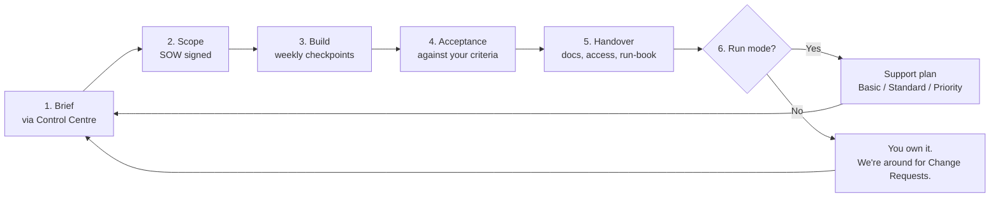

# Engine Labs — Page Information Architecture & Full Copy

**Status:** Source of truth for what every page on `enginelabs.com.au` says.
**Authority:** Derived from `strategy/01-positioning.md` through `strategy/06-copy-rules.md`. No copy on this page contradicts the contract pack. Where it does, the contract pack wins and this doc is wrong.
**Voice:** Australian English. Operator voice. Short sentences. `A$` prefix on all pricing. No emojis. None of the retired words from `01-positioning.md` (no "solutions", "cutting-edge", "harness", "leverage", "enterprise-grade", "end-to-end", "bespoke AI partner", "transform", "revolutionise", "disrupt").
**Cross-references:** Section notes cite rules R1–R10 and voice rules V1–V3 from `strategy/06-copy-rules.md`.

---

## 1. Site map

```mermaid
graph TD
    Home[/ Home /]
    Engines[/engines — index/]
    EngSales[/engines/sales/]
    EngOps[/engines/ops/]
    EngSupport[/engines/support/]
    EngInsight[/engines/insight/]
    EngFounder[/engines/founder/]
    EngKnowledge[/engines/knowledge/]
    EngBackOffice[/engines/back-office/]
    EngOutreach[/engines/outreach/]
    Verticals[/verticals — index/]
    VFounders[/verticals/founders/]
    VAgencies[/verticals/agencies/]
    VTrades[/verticals/trades/]
    VEcomm[/verticals/ecommerce/]
    VRecruiters[/verticals/recruiters/]
    VCoaches[/verticals/coaches/]
    Centre[/control-centre — deep link/]
    Methodology[/methodology/]
    Lab[/lab — index/]
    LabPost[/lab/&lt;post-slug&gt;/]
    Dont[/what-we-dont-do/]
    Pricing[/pricing/]
    About[/about/]
    FAQ[/faq/]
    Privacy[/privacy/]
    Terms[/terms/]
    Legal[/legal/]

    Home --> Engines
    Home --> Verticals
    Home --> Centre
    Home --> Lab
    Home --> Methodology
    Home --> Dont
    Home --> Pricing

    Engines --> EngSales
    Engines --> EngOps
    Engines --> EngSupport
    Engines --> EngInsight
    Engines --> EngFounder
    Engines --> EngKnowledge
    Engines --> EngBackOffice
    Engines --> EngOutreach

    Verticals --> VFounders
    Verticals --> VAgencies
    Verticals --> VTrades
    Verticals --> VEcomm
    Verticals --> VRecruiters
    Verticals --> VCoaches

    Lab --> LabPost
    Legal --> Privacy
    Legal --> Terms

    EngSales -. cross-link .-> VTrades
    VTrades -. seeds brief into .-> Centre
    Methodology -. linked from FAQ + Engines .-> FAQ
```

### Route surfacing rules

| Route | Primary nav | Footer | Contextual only |
|---|---|---|---|
| `/` (home) | yes (logo) | yes | |
| `/engines` | yes | yes | |
| `/engines/<engine>` | no | no | yes (from Engines index, Control Centre, Lab posts, vertical pages) |
| `/verticals` | no | yes | yes (from "For…" homepage tiles) |
| `/verticals/<vertical>` | no | no | yes |
| `/control-centre` | no (it's the hero, not a nav item — but deep-link exists for sharing) | yes ("Open the Control Centre") | yes |
| `/methodology` | yes | yes | yes (FAQ, Engines) |
| `/lab` | yes | yes | |
| `/lab/<post>` | no | no | yes |
| `/what-we-dont-do` | no | yes | yes (hero, Control Centre header, decline messages) |
| `/pricing` | yes | yes | |
| `/about` | no | yes | |
| `/faq` | no | yes | |
| `/privacy` | no | yes (legal column) | |
| `/terms` | no | yes (legal column) | |
| `/legal` | no | yes (legal column) | |

---

## 2. Primary nav and footer

### Primary nav (5 items max)

Left: **Engine Labs** wordmark → `/`

Right (in order, left to right):

1. **Engines** → `/engines`
2. **Methodology** → `/methodology`
3. **Lab** → `/lab`
4. **Pricing** → `/pricing`
5. **Open the Control Centre** (button, accent style) → scrolls to `#control-centre` on `/`, or opens `/control-centre` on subpages

Mobile: the wordmark and the **Open the Control Centre** button stay visible. Items 1–4 collapse into a hamburger menu.

### Footer

Four columns, plus a wide bottom row.

**Column 1 — Engine Labs**
- One-paragraph "about" boilerplate from `01-positioning.md`:
  > Engine Labs is a one-operator AI build studio. We design and ship Engines — small, productized AI workflows, agents and internal tools — that retire repeatable work inside small businesses, agencies and founder-led teams. Every build comes with a fixed scope, a fixed price, a published spec sheet and a clean handover. No retainers required, no enterprise theatre, no promises we can't back up in a contract.
- Tagline below: *An agentic company, building agentic companies.*

**Column 2 — Engines**
- Sales Engine
- Ops Engine
- Support Engine
- Insight Engine
- Founder Engine
- Knowledge Engine
- Back-office Engine
- Outreach Engine
- See all → `/engines`

**Column 3 — Company**
- How we work → `/methodology`
- From the Lab → `/lab`
- Pricing → `/pricing`
- What we don't do → `/what-we-dont-do`
- About → `/about`
- FAQ → `/faq`

**Column 4 — Get in touch**
- Open the Control Centre → `/control-centre`
- Email: hello@enginelabs.com.au
- LinkedIn → (link TBD)
- X / Twitter → (link TBD)
- GitHub → (link TBD, for Lab artefacts)

**Bottom row**
Left: © 2026 Engine Labs. ABN [TBD]. Based in Sydney, Australia. AUD pricing, GST exclusive unless stated.
Right: Privacy · Terms · Legal

---

## 3. Homepage copy — section by section

Page slug: `/` · Title tag and meta in §8.

### Section 3.1 — Hero with Control Centre input

- **Layout:** Full-bleed top section. Left two-thirds: headline, subhead, single multi-line input field with placeholder, primary CTA, secondary CTA, three preset prompt chips below the input. Right one-third: short "what is this?" panel that explains the Control Centre in 4 lines. Subtle dogfood badge under the input.
- **Headline:** Stop hiring for repeatable work. Engineer it instead.
- **Subhead:** Engine Labs is a one-operator AI build studio. We design and ship small Engines — agents, workflows and internal tools — that retire admin, replies and reporting inside your business. Fixed scope, fixed price, clean handover.
- **Body copy (panel right of input):**
  > **What is this?**
  > The box on the left is our Control Centre. Type the thing slowing your business down. It will ask a few questions, recommend an Engine, and draft a one-page scope and starting price you can take away. No call required. No email captured unless you ask for one.
- **Input placeholder:** What's slowing your business down? We'll draft a solution for you.
- **Input helper text below field:** Don't paste secrets, API keys or sensitive personal information here. Drafts are kept for your session only.
- **Preset chips (under input):**
  - I'm a tradie missing leads
  - Agency owner drowning in status reports
  - Founder needs an MVP for an investor demo
- **CTA buttons:**
  - Primary (inside input, right): **Draft my brief**
  - Secondary (text link under input): **See the Engines first** → `#engines`
- **Dogfood badge under input (small text):** This Control Centre was built with the Founder Engine. See the SOW →
- **Copy rule notes:**
  - **R1** (no outcome guarantees): no "we'll get you leads / save X hours / X% lift" — only verbs of substitution.
  - **R4** (no enterprise claims): "small Engines", "one-operator", "small businesses".
  - **R5** (pricing posture): the input promises a *draft* and a *starting price*, not a fixed quote.
  - **R10** (data class warnings): the helper text under the input addresses Addendum §2 directly.
  - **V2** (verbs over adjectives): "retire admin, replies and reporting" not "transformative AI for SMBs".

### Section 3.2 — Control Centre demo (live, not behind a click)

- **Layout:** Full-bleed section immediately below the hero. The Control Centre interface is *embedded inline*, not behind a button. Left: the conversational thread (placeholder example turn + ghost of clarifying question). Right: the draft SOW preview pane (collapsed by default, expands as the conversation progresses). Persistent header strip across the embed: "**What we don't do →**" link, "**Privacy →**" link, "**Save my brief →**" button.
- **Section eyebrow (above):** The Control Centre
- **Headline:** Brief it. We draft it. You decide.
- **Subhead:** Every visitor's first interaction with Engine Labs is using Engine Labs. Type a problem, answer a few questions, get a one-page scope and a starting price. No commitment. No phone tag.
- **Body copy (callouts around the demo):**
  - **What it does:** Reads your brief, asks up to five clarifying questions, recommends one or more Engines, and drafts a one-page Statement of Work with a price band you can take to your accountant or your board.
  - **What it won't do:** Quote a fixed price for ambiguous work. Promise a business outcome. Take on builds the contract pack excludes — it'll decline politely and tell you why.
  - **How long it takes:** Two to four minutes for most briefs.
- **CTA buttons:**
  - Primary (jumps cursor back into the hero input): **Try it now**
  - Text link: **See an example brief and the SOW it drafted** → `/lab/<centre-example-post>`
- **Dogfood footer line (sticky to the bottom of the embed):** This Control Centre was built with the Founder Engine in [X] days for A$[Y] AUD. See the SOW →
- **Copy rule notes:**
  - **R2** (human review): "You decide." "We draft it." Never auto-send.
  - **R5** (pricing posture): "price band you can take to your accountant" — band, not fixed.
  - **R7** (support opt-in): nothing here promises ongoing service.
  - **Substitute 1 + X2** (`05-portfolio-substitutes.md`, `04-control-centre.md`): dogfood footer is permanent.

### Section 3.3 — The Engines (8-tile grid)

- **Layout:** 8 tiles, 4 across × 2 down on desktop, 2 × 4 on tablet, 1 × 8 on mobile. Each tile: Engine name (H3), one-sentence outcome, two-line "replaces" line, price band, "See the spec sheet →" link. Section anchor: `#engines`.
- **Section eyebrow (above):** The catalog
- **Headline:** Eight Engines. One catalog. Pick the one that retires your worst week.
- **Subhead:** Each Engine is a productized build with a published spec sheet, a starting price, and a real handover. Stack them if you need to — the Control Centre will tell you which combination fits your brief.
- **Tile copy (8 tiles, in order):**

  **1. Sales Engine** *(/engines/sales)*
  - One-liner: Catch every inbound lead, qualify it, hand you a warm conversation.
  - Replaces: A junior SDR or inbound coordinator.
  - Price: From **A$650 AUD**, scoped in the Control Centre.

  **2. Ops Engine** *(/engines/ops)*
  - One-liner: Run the recurring admin a chief-of-staff would otherwise do.
  - Replaces: An ops coordinator chasing approvals, status updates and reminders.
  - Price: From **A$650 AUD**, scoped in the Control Centre.

  **3. Support Engine** *(/engines/support)*
  - One-liner: Read every ticket, draft the reply, queue it for your one-click send.
  - Replaces: A tier-1 support inbox jockey.
  - Price: From **A$650 AUD**, scoped in the Control Centre.

  **4. Insight Engine** *(/engines/insight)*
  - One-liner: A dashboard and a weekly written summary that prepares your Monday meeting for you.
  - Replaces: A weekly reporting analyst.
  - Price: From **A$450 AUD**, scoped in the Control Centre.

  **5. Founder Engine** *(/engines/founder)*
  - One-liner: A clickable prototype, an MVP and a build roadmap in weeks, not months.
  - Replaces: A fractional CTO plus a product designer for the first sprint.
  - Price: From **A$750 AUD**, scoped in the Control Centre.

  **6. Knowledge Engine** *(/engines/knowledge)*
  - One-liner: A private chat that answers your team's "how do we do X" from your own docs.
  - Replaces: Senior staff being a Slack help desk.
  - Price: From **A$650 AUD**, scoped in the Control Centre.

  **7. Back-office Engine** *(/engines/back-office)*
  - One-liner: Read your invoices, receipts and supplier docs and draft the records for your bookkeeper to review.
  - Replaces: The data-entry half of bookkeeping.
  - Price: From **A$650 AUD**, scoped in the Control Centre.

  **8. Outreach Engine** *(/engines/outreach)*
  - One-liner: Draft personalised messages to people you already have permission to contact.
  - Replaces: The hours you spend writing re-engagement, follow-up or win-back messages by hand.
  - Price: From **A$1,350 AUD**, scoped in the Control Centre. (Higher starting price because consent verification is mandatory.)

- **Section footer:** All eight Engines, all prices, all exclusions → **See the full catalog** → `/engines`
- **Copy rule notes:**
  - **R1** (no outcome guarantees): tiles describe work retired, not outcomes promised.
  - **R5** (pricing posture): every tile shows "From A$X AUD, scoped in the Control Centre".
  - **R9** (outreach consent): the Outreach tile explicitly says "people you already have permission to contact".
  - **V2** (verbs over adjectives): no "powerful", "advanced", "intelligent" — only verbs of substitution.

### Section 3.4 — For… (6 vertical tiles)

- **Layout:** 6 tiles, 3 across × 2 down on desktop. Each tile: vertical name (H3), one-line pain in the buyer's words, suggested Engine stack as tags, "See the [vertical] setup →" link.
- **Section eyebrow:** Built for
- **Headline:** Six kinds of business already asking us for this.
- **Subhead:** The Engines are the same. The way they stack, the example briefs and the integrations differ by who you are. Pick the closest fit — the Control Centre will tailor from there.
- **Tile copy:**

  **For solo founders & pre-seed teams** *(/verticals/founders)*
  - Pain: "I need to test the idea before I quit my job or raise a round."
  - Stack: Founder Engine · Insight Engine · Knowledge Engine
  - **See the founder setup →**

  **For small marketing & creative agencies** *(/verticals/agencies)*
  - Pain: "Half my senior team's week is status reports, approvals and 'where's that file?'"
  - Stack: Ops Engine · Insight Engine · Knowledge Engine
  - **See the agency setup →**

  **For trades & service businesses** *(/verticals/trades)*
  - Pain: "My phone rings while I'm on the tools. I lose jobs to whoever rang back first."
  - Stack: Sales Engine · Support Engine · Back-office Engine
  - **See the trades setup →**

  **For e-commerce & direct-to-consumer** *(/verticals/ecommerce)*
  - Pain: "Support inbox is the bottleneck. Reporting takes me a full Monday."
  - Stack: Support Engine · Insight Engine · Back-office Engine
  - **See the e-commerce setup →**

  **For recruiters & staffing** *(/verticals/recruiters)*
  - Pain: "Actual recruiting is 20% of my week. The rest is admin."
  - Stack: Sales Engine · Ops Engine · Knowledge Engine
  - **See the recruiter setup →**

  **For coaches, consultants & course creators** *(/verticals/coaches)*
  - Pain: "Enquiry to onboarded is all me, all manual."
  - Stack: Sales Engine · Knowledge Engine · Outreach Engine
  - **See the coach setup →**

- **Section footer:** Not on this list? **Brief us anyway →** (anchors back to the Control Centre input.)
- **Copy rule notes:**
  - **V3** (examples over claims): each tile shows the suggested stack, not a generic value prop.
  - **R3** (no regulated decisions): healthcare, law, lending and insurance are not featured — per `03-verticals.md` "Verticals deliberately not featured".

### Section 3.5 — How we work (Build → Run loop with mermaid)

- **Layout:** Full-width section. Left half: the mermaid diagram rendered. Right half: numbered list (1–6) with one sentence per step. Centred CTA below.
- **Section eyebrow:** The methodology
- **Headline:** One loop. Six steps. Same for every build.
- **Subhead:** No mystery. No "discovery phase that lasts a quarter". You brief it, we scope it, we build it, you accept it, you get the handover, and you choose whether we stay on to run it.
- **Diagram (rendered inline):**

- **Body copy (numbered list, right of diagram):**
  1. **Brief.** Use the Control Centre. Two to four minutes. You get a recommendation and a draft SOW.
  2. **Scope.** Cam reviews the draft, refines it, sends a final SOW with a fixed price for in-scope work. Larger or ambiguous briefs start with a paid scoping workshop.
  3. **Build.** Weekly checkpoints. Your access stays your access — we work in your tools where possible.
  4. **Acceptance.** Tested against the acceptance criteria written into the SOW. No "is it done?" — there's a checklist.
  5. **Handover.** Repo, credentials, prompts, run-book, known limitations. Yours to keep.
  6. **Run mode (optional).** If you want us to keep an eye on it, you choose a support plan (Basic Care, Standard Care, Priority Care). If not, you own it and we're available for Change Requests.
- **CTAs:**
  - Primary: **Read the full methodology** → `/methodology`
  - Secondary: **Download the intake checklist (PDF)** → `/methodology#downloads`
- **Copy rule notes:**
  - **R5** (pricing posture): "fixed price for in-scope work" + "paid scoping workshop" for ambiguous work.
  - **R7** (support opt-in): Run mode is *optional* and tiered.
  - **R6** (IP language): "yours to keep" describes the handover, not "you own everything we build".
  - Substitute 2 (`05-portfolio-substitutes.md`): the methodology is public and downloadable.

### Section 3.6 — Pricing transparency

- **Layout:** Section header centred. Below it, a 4-column responsive table of the package tiers (Basic / Standard / Premium / Custom). Each row shows: tier, what it suits, starting price in AUD, what triggers a custom quote. Below the table: the "from A$X" rule paragraph and the AUD/GST footer.
- **Section eyebrow:** Pricing
- **Headline:** The starting prices. Visible. AUD. GST exclusive unless stated.
- **Subhead:** Every Engine is priced "from A$X". That's the starting tier for a narrow, clearly accepted scope. Larger or ambiguous projects start with a paid scoping workshop and a custom SOW. No guessing on either side.
- **Pricing table:**

  | Tier | Suits | Starting from (AUD) | Notes |
  |---|---|---|---|
  | **Basic** | One Engine, single source/channel, single tool, narrow scope | from **A$450** | Fixed-price for genuinely narrow scopes. |
  | **Standard** | One Engine with multiple sources or integrations, or a focused stack | from **A$1,200** | Most Sales / Support / Ops / Knowledge briefs land here. |
  | **Premium** | Multi-source, multi-integration, custom tone or workflow library | from **A$3,500** | Includes documentation and accuracy benchmarks. |
  | **Custom** | Stacked Engines, ambiguous scope, larger MVPs, integration-heavy builds | **Starts with a paid scoping workshop** | Workshop fee is credited against the final fee if you proceed. |

- **Body copy below table:**
  - Every price on this site is in Australian dollars, GST exclusive unless stated. "From A$X" means the starting tier price for a narrow, clearly accepted scope. The Control Centre will give you a band — not a fixed quote — and Cam will confirm the final SOW before any work begins.
  - The full per-Engine price band is on each Engine page (`/engines/<engine>`) and the complete Pricing Schedule is at `/pricing`.
- **CTAs:**
  - Primary: **See the full pricing schedule** → `/pricing`
  - Secondary: **Scope my brief in the Control Centre** → `#control-centre`
- **Copy rule notes:**
  - **R5** (pricing posture): "from A$X", "scoping workshop", "AUD", "GST exclusive" — all four required cues.
  - **R4** (no enterprise claims): no "enterprise" tier; the highest tier is "Custom" and gated by a workshop.
  - **V1** (Australian English): AUD, GST, Sydney-implicit.

### Section 3.7 — What we don't do (anti-claim)

- **Layout:** Full-bleed section with strong contrast (dark or accent background, light type). Two columns: left "What we don't do", right "What we won't promise". Each bullet is a single short line. Subhead and intro above, link to the long-form below.
- **Section eyebrow:** Boundaries
- **Headline:** What we don't do, and what we won't promise.
- **Subhead:** Most agencies hide this in the fine print. We put it on the homepage. If your brief lands in one of these columns, the Control Centre will say so and offer a referral.
- **Body copy (two columns, verbatim from `05-portfolio-substitutes.md` Substitute 5):**

  **What we don't do**
  - We don't build systems that make legal, medical, financial, employment, credit, insurance, immigration, housing or safety decisions on behalf of humans. Those decisions need a regulated professional, not an agent.
  - We don't take on production-grade cyber security, penetration testing, SOC2 / ISO certification or regulated compliance ownership.
  - We don't build mission-critical infrastructure where a failure has material legal, financial or safety consequence.
  - We don't scrape restricted platforms, extract data from sources that breach platform terms, or build mass-cold-outreach systems on unconsented lists.
  - We don't take on managed hosting, 24/7 monitoring, or enterprise DevOps.

  **What we won't promise**
  - We won't promise a revenue lift, lead volume, conversion rate, response time or AI accuracy number. Anyone who does is making it up.
  - We won't promise uptime guarantees beyond what the underlying third-party tools offer.
  - We won't promise that an AI output will always be correct. The human-review step is non-negotiable.
  - We won't quote a fixed price for unclear scope. Larger or ambiguous projects start with a paid scoping workshop.

- **CTA:** **The long version, with the clauses each line comes from** → `/what-we-dont-do`
- **Copy rule notes:**
  - **R1, R2, R3, R4, R5, R8, R9** — this section is the canonical home of every "no" rule.
  - **V4** (show the boundaries): treated as marketing copy, not fine print.

### Section 3.8 — Governance & security (Addendum summary)

- **Layout:** Section header, then three columns: "Data", "AI outputs", "Third-party tools". Each column has a 3-line summary and a "Read the Addendum →" link.
- **Section eyebrow:** Governance and security
- **Headline:** The same Addendum, on every build. No surprises.
- **Subhead:** Every SOW we sign attaches the AI, Data and Security Addendum. Here's the short version. The full version is in the contract pack you sign before the build starts.
- **Body copy (three columns):**

  **Data**
  - Four classes: public, internal, personal, sensitive. We mirror Addendum §2.
  - Personal data needs an explicit SOW provision. Sensitive or regulated data is excluded by default.
  - Brief retention is 90 days unless you save the brief; saved briefs persist until you delete them.

  **AI outputs**
  - For anything that touches a customer, contract, account, money or person's record, a human approves before send. No exceptions.
  - Internal classification, tagging, scoring, summarising and alerting can run unattended.
  - Every AI-drafted reply is labelled as a draft until a human sends it.

  **Third-party tools**
  - Your Engines run on third-party AI providers, integrations and platforms. We don't control them.
  - If a model is deprecated, a price changes, a rate limit drops or an API breaks, we'll tell you and quote any rework.
  - You'll have the dependency list in the handover pack on day one.

- **CTA:** **Read the full Addendum** → `/legal#addendum` (or a PDF link, TBD with legal review)
- **Copy rule notes:**
  - **R2** (human review): exactly stated, with the internal/external line drawn.
  - **R8** (third-party reality): every word in column three.
  - **R10** (data classes): the four classes named, with retention.

### Section 3.9 — From the Lab (3 latest posts)

- **Layout:** Section header, then 3 post cards in a row. Each card: post title, 2-line summary, "Engine: X · Vertical: Y" tags, "Read the build →" link. CTA below.
- **Section eyebrow:** Build in public
- **Headline:** Every week, we publish a build.
- **Subhead:** A new Engine, a new prompt, a new workflow — fully documented, including what didn't work. No clients required, no NDA risk, all owned by us. Take what you like.
- **Card content (placeholders, sourced from `05-portfolio-substitutes.md` initial backlog):**

  **Card 1 — Building the Control Centre that built itself**
  - The Founder Engine SOW for this site. Tools, timeline, cost, what changed mid-build.
  - Tags: Founder Engine · Solo founders
  - **Read the build →**

  **Card 2 — A missed-call rescue Engine for a tradesman**
  - SMS → qualified callback → calendar invite. Built in one evening with the exact prompt published.
  - Tags: Sales Engine · Trades
  - **Read the build →**

  **Card 3 — What happened when I asked the Control Centre to scope a regulated medical chatbot**
  - The decline path as content. Why the answer was "no" and what we offered instead.
  - Tags: Control Centre · Governance
  - **Read the build →**

- **CTA:** **All posts in the Lab** → `/lab`
- **Copy rule notes:**
  - **V3** (examples over claims): the entire section is examples.
  - Substitute 4 (`05-portfolio-substitutes.md`): minimum cadence one per week, missing weeks acknowledged.

### Section 3.10 — FAQ (excerpted, 10 Q&As)

- **Layout:** Accordion list of 10 questions. Each answer 2–4 sentences. Below the list, a "More questions →" link to the full FAQ.
- **Section eyebrow:** FAQ
- **Headline:** Ten things people ask before they brief us.
- **Subhead:** The contracts answer all of these in more detail. These are the plain-English versions.
- **Q&As:**

  **1. Who owns the code and content you build for me?**
  You own the bespoke deliverables we build specifically for you, on full payment. We keep our reusable templates, prompts and workflow patterns and licence them to you perpetually as part of your deliverable. Your data is yours, always. (MSA §13. Copy rule R6.)

  **2. What's the difference between the starting price and what I'll actually pay?**
  The "from A$X" is the starting-tier price for a narrow, clearly accepted scope. The Control Centre gives you a band based on your brief. Larger or unclear projects start with a paid scoping workshop, then a custom SOW. The workshop fee is credited against the final fee if you proceed. (Pricing §7. Copy rule R5.)

  **3. Are the AI replies sent automatically?**
  No. For anything that touches a customer, contract, account, money or person's record, a human approves before send. Drafts are queued in your inbox or tool of choice for one-click send. Internal classification, tagging and routing can run unattended. (MSA §12, Addendum §4. Copy rule R2.)

  **4. What happens if a third-party tool changes?**
  Your Engines run on tools we don't control — OpenAI, Anthropic, Zapier, Slack, Stripe, your CRM, and so on. If a model is deprecated, a price changes, a rate limit drops or an API breaks, we'll tell you and quote any rework. You'll have the dependency list in your handover. (MSA §11. Copy rule R8.)

  **5. How many revisions do I get?**
  Each SOW includes a defect-fix period of 7 to 14 days after acceptance, depending on the package. Within that window we fix anything that doesn't match the SOW at no extra cost. Beyond that, support is a separate plan — Basic Care, Standard Care or Priority Care — and you choose whether to opt in. (SLA §1, §2, §3. Copy rule R7.)

  **6. Do you do cold outreach or scrape data?**
  No. The Outreach Engine only works on lists where you can demonstrate consent or an existing business relationship. No scraping, no purchased lists, no harvested contacts. If your brief includes cold outreach, the Control Centre will decline and explain why. (Addendum §5, §7, ACMA spam rules. Copy rule R9.)

  **7. Do you build AI for legal, medical, financial, hiring or credit decisions?**
  No. Those are regulated decisions that need a regulated professional. We can build the admin layer around them — intake forms for a law firm, supplier paperwork for a clinic, candidate screening drafts for a recruiter to review — but never the decision itself. (MSA §3, Addendum §5. Copy rule R3.)

  **8. What data is safe to give the Engine?**
  Public data is fine. Internal business data is fine with care. Personal information needs an explicit provision in the SOW. Sensitive or regulated data (health records, financial advice data, identity documents) is excluded by default and needs a separate conversation. Never paste secrets, API keys or passwords into the Control Centre. (Addendum §2. Copy rule R10.)

  **9. How long does a build take?**
  Most Engines: 1 to 4 weeks. The Founder Engine MVP track: 2 to 6 weeks. The Control Centre will give you a calendar-week range based on the brief.

  **10. Why might you decline my brief?**
  Three reasons. One: it falls inside one of the excluded categories (regulated decisions, mission-critical, security ownership, cold outreach). Two: the brief is too unclear to quote responsibly — in which case we'll suggest a paid scoping workshop or free 20 minute discovery call. Three: the brief needs a senior software engineering firm or a regulated specialist that we are not. We'll tell you which.

- **CTA:** **The full FAQ** → `/faq`
- **Copy rule notes:**
  - **R1–R10** all referenced.
  - **V3** (examples over claims): every answer ends with a clause reference.

### Section 3.11 — Footer CTA (back to the Control Centre)

- **Layout:** Full-bleed accent-coloured section. Single column, centred. Big headline, short sub, one input + one button (same Control Centre input, re-anchored), with the helper line under.
- **Section eyebrow:** Back to where we started
- **Headline:** Brief us. Get a draft. Decide later.
- **Subhead:** Two to four minutes. No email captured unless you ask. A one-page scope and a starting price you can take away.
- **Input placeholder:** What's slowing your business down? We'll draft a solution for you.
- **CTA buttons:**
  - Primary: **Draft my brief**
  - Secondary: **Book a 20-minute call with Cam** → (Cal.com link, TBD)
- **Helper text:** Don't paste secrets, API keys or sensitive personal information here. AUD pricing, GST exclusive unless stated.
- **Copy rule notes:**
  - **R10**, **R5**, **R1** — same hero rules.

---

## 4. Engine landing page template

**Route:** `/engines/<engine-slug>`
**Each of the 8 Engine pages already exists as a spec sheet in `strategy/02-engines/`. This template is the wrapper around the spec sheet that turns it into a shippable page.**

### Page IA (top to bottom)

1. **Breadcrumbs:** `Home / Engines / [Engine name]`
2. **Eyebrow + H1**
   - Eyebrow: "Engine"
   - H1: `[Engine name]` (e.g. "Sales Engine")
3. **One-sentence outcome** (the hero subhead — taken verbatim from line 3 of the spec sheet)
4. **Primary CTA inline:** `Configure this in the Control Centre →` (anchors to home `#control-centre` with the Engine pre-selected via querystring `?engine=sales`)
5. **At-a-glance row (4 small cards):**
   - **Replaces:** [the role from "The work it retires"]
   - **From:** A$[X] AUD, scoped in the Control Centre
   - **Typical timeline:** [X]–[Y] weeks
   - **Stack tier:** Workflow Automation / AI Agent / Internal Tools / etc.
6. **Section: The work it retires** (1 paragraph, from spec sheet)
7. **Section: Inputs** (3 bullets, from spec sheet)
8. **Section: Outputs** (3 bullets, from spec sheet)
9. **Section: What's included** (bulleted, from spec sheet)
10. **Section: What's not included** (bulleted, from spec sheet — styled with subtle contrast so it reads as deliberate, not as fine print; per V4)
11. **Section: Human review** (1 paragraph, from spec sheet — required by R2)
12. **Section: Typical integrations** (chip cloud of named tools, from spec sheet)
13. **Section: Pricing detail** (3 tier rows: Basic / Standard / Premium, prices in AUD with "from" framing — from spec sheet; R5)
14. **Section: Dogfood note** (where the spec sheet has one — Sales, Founder, and any future spec sheets)
15. **Section: Related Engines** (3 tiles, manually curated per Engine — see mapping below)
16. **Section: Suggested verticals** (chips linking to vertical pages — see mapping below)
17. **Section: From the Lab — builds using this Engine** (3 most recent Lab posts tagged with this Engine; if fewer than 3 exist, show what's there)
18. **Section: FAQ specific to this Engine** (4–6 Q&As — drawn from the homepage FAQ plus Engine-specific ones)
19. **Footer CTA:** Big band with `Configure this in the Control Centre →` button, plus the dogfood line for the Control Centre.
20. **Standard site footer.**

### Related Engines and suggested verticals mapping

| Engine | Related Engines (show 3) | Suggested verticals |
|---|---|---|
| Sales | Ops, Outreach, Insight | Trades, Recruiters, Coaches |
| Ops | Sales, Knowledge, Insight | Agencies, Recruiters |
| Support | Knowledge, Insight, Ops | E-commerce, Coaches |
| Insight | Ops, Support, Sales | Agencies, E-commerce, Founders |
| Founder | Insight, Knowledge, Sales | Founders |
| Knowledge | Support, Ops, Insight | Agencies, Recruiters, Coaches |
| Back-office | Ops, Insight, Support | Trades, E-commerce |
| Outreach | Sales, Knowledge, Insight | Coaches, Agencies (with consent caveat) |

### Engine page copy notes (apply to all 8)

- The H1 is always just the Engine name. The one-sentence outcome is the hero subhead. No re-phrasing of the spec sheet — the spec sheet is the source of truth.
- Pricing block must include: `A$` prefix, "from", "scoped in the Control Centre", and "AUD" — per R5.
- "What's not included" is a styled section, not a footnote — per V4.
- The "Human review" section is **mandatory on every Engine page** (R2). The Outreach Engine adds the Brief Gate copy beneath it.
- The Outreach Engine page also surfaces the consent warning above the fold, taken from the spec sheet's intro blockquote (R9).
- The Back-office Engine page surfaces "We do not give bookkeeping, tax, BAS, GST, financial or accounting advice" above the fold (R3).
- The Founder Engine page surfaces the dogfood note prominently (Substitute 3, X2).

---

## 5. Vertical landing variant

**Route:** `/verticals/<vertical-slug>`

### What's the same as the homepage

- The header nav, footer and Control Centre embed are identical.
- The Engines grid (Section 3.3) appears as a secondary section, with the suggested stack pinned to the top (Sales / Support / Back-office in this example) and the rest greyed back as "also available".
- The "What we don't do" section (3.7), governance section (3.8) and "From the Lab" (3.9, filtered to the relevant vertical) all appear.

### What's different from the homepage

- **Hero copy:** vertical-specific (uses the "Pain (in their words)" and "Hook line" from `03-verticals.md`).
- **Suggested Engine stack:** expanded as a dedicated section (not just an 8-tile grid), explaining how the three Engines stack for this vertical.
- **Pre-seeded Control Centre brief:** the example brief from `03-verticals.md` is pre-filled in the Control Centre input.
- **Lab posts:** filtered to posts tagged with this vertical.
- **Vertical-specific FAQ:** 3–5 Qs that are higher priority for that buyer (e.g. for trades: "Does this work if I'm on the tools all day?", "What about after-hours enquiries?", "What if I don't have a CRM?").

### Vertical page IA (top to bottom)

1. Breadcrumbs: `Home / Built for / [vertical name]`
2. Hero: H1 (vertical-specific), subhead (the hook line), Control Centre input pre-seeded with the example brief.
3. Pain in their words (a single quote-block).
4. Suggested Engine stack — expanded section with one panel per Engine explaining how it fits this vertical specifically.
5. Engines grid (all 8 — stack at top, rest below).
6. How we work (the same Build → Run loop).
7. Pricing transparency (same table).
8. What we don't do (same).
9. From the Lab (filtered).
10. Vertical FAQ.
11. Footer CTA (Control Centre, pre-seeded).
12. Standard site footer.

---

### 5.1 Worked example — `/verticals/trades` (full copy)

This is the worked example. The other five verticals follow the same pattern, with content swapped per `03-verticals.md`.

#### Hero

- **Eyebrow:** Built for trades & service businesses
- **H1:** Stop losing jobs to whoever rang back first.
- **Subhead:** Engine Labs builds inbound Engines for plumbers, sparkies, landscapers, cleaners, removalists, builders, etc. We catch every enquiry, qualify it, and put a same-hour draft reply in your phone — even when you're on the tools.
- **Pre-seeded brief in Control Centre input:** "I'm a plumber. I get 10–20 enquiries a week from my website and Google. I want every one of them captured, qualified, and a draft quote-or-callback message ready in my phone within an hour."
- **CTAs:** Primary **Draft my trades Engine** · Secondary **See the suggested stack** → `#stack`
- Copy rule notes: R1 (no "we'll get you more jobs"), R5 (no fixed price promise), R10 (helper text under input retained).

#### Pain section (quote block)

> "My phone rings while I'm on the tools. I miss leads. I'm slow to quote. Half the leads I do answer ghost because I take two days to reply."
> — Every tradie we've ever spoken to.

#### Suggested Engine stack (anchor `#stack`)

- **Eyebrow:** The trades stack
- **Headline:** Three Engines. One operator's worth of work, off your plate.
- **Subhead:** This is the stack we recommend for most service businesses with 1–10 staff. The Control Centre will tell you which one to start with and how to add the others later.
- **Panel 1 — Sales Engine (start here):** Catches every web form, missed call, email and DM. Qualifies against your rules (job type, location, urgency). Drops the qualified lead into your CRM (or a simple sheet, if you don't have one) and drafts the first reply to sit in your phone. You hit send. From **A$650 AUD**, scoped in the Control Centre. **See the Sales Engine →** `/engines/sales`
- **Panel 2 — Support Engine (add when you're drowning):** Reads after-hours enquiries, drafts a holding reply, queues the real reply for the morning. Stops "I'll call you back" from ever happening again. From **A$650 AUD**, scoped in the Control Centre. **See the Support Engine →** `/engines/support`
- **Panel 3 — Back-office Engine (add when bookkeeping is the bottleneck):** Reads supplier invoices and receipts from your inbox or Dropbox, extracts the line items, and drafts the records for your bookkeeper to review in Xero or MYOB. From **A$650 AUD**, scoped in the Control Centre. **See the Back-office Engine →** `/engines/back-office`

#### Engines grid (all 8)

Identical to homepage Section 3.3, with the three trades-stack Engines visually pinned to the top.

#### How we work

Identical to homepage Section 3.5.

#### Pricing transparency

Identical to homepage Section 3.6.

#### What we don't do

Identical to homepage Section 3.7. (For trades, two lines are worth highlighting: "no managed hosting / 24/7 monitoring" and "no production-grade cyber security" — both relevant to the "is this safe?" objection.)

#### From the Lab (trades-tagged)

3 most recent Lab posts tagged `trades`. At launch, this will include:
- *A tradesman missed-call rescue agent. SMS → qualified callback → calendar invite. Built in one evening.*
- (Post 2 — TBD by week 4)
- (Post 3 — TBD by week 8)

#### Vertical FAQ (trades-specific)

- **Will this work if I'm on the tools all day and can't sit at a laptop?** Yes. The Engines push draft replies to your phone (SMS, email, or your CRM app). You approve from your phone with one tap.
- **What if I don't have a CRM?** A spreadsheet works for the Basic tier. We'll set up a simple Airtable or Google Sheet. If you want a real CRM later, we'll migrate it as part of a Standard tier scope.
- **What about after-hours enquiries?** The Support Engine drafts a holding reply immediately (e.g. "Thanks for reaching out, I'll be back to you by 9am") and queues the real reply for the morning. No customer is left waiting in silence overnight.
- **Will the Engine quote jobs for me?** No. The Engine drafts the reply. You quote. Anything that quotes a customer or commits you to a price needs a human (R2).
- **How much will I actually pay?** Most trades briefs land at Standard tier (from **A$1,200 AUD**) with two channels and one CRM. The Control Centre will give you a band based on your specific setup.

#### Footer CTA

- **Headline:** Brief us. Get a trades-specific draft.
- **Subhead:** Two to four minutes. We'll pre-fill the example brief — edit it to match your setup.
- Input pre-seeded with the trades example brief.
- CTAs: **Draft my trades Engine** · **Book a 20-minute call with Cam**

### 5.2 Other vertical variants (apply same template)

The other five vertical pages follow the exact same structure with copy swapped from `03-verticals.md`:

| Slug | H1 | Pre-seeded brief source | Stack |
|---|---|---|---|
| `/verticals/founders` | Ship a prototype in two weeks. Find out if your idea has legs. | `03-verticals.md` Vertical 1 example brief | Founder · Insight · Knowledge |
| `/verticals/agencies` | Give your senior team back the hours they spend on status reports and approvals. | Vertical 2 example brief | Ops · Insight · Knowledge |
| `/verticals/trades` | *(worked above)* | Vertical 3 example brief | Sales · Support · Back-office |
| `/verticals/ecommerce` | A support inbox that drafts every reply. A weekly read of your numbers that writes itself. | Vertical 4 example brief | Support · Insight · Back-office |
| `/verticals/recruiters` | Get out of the inbox. Let the Engine catch, qualify, schedule and remind. | Vertical 5 example brief | Sales · Ops · Knowledge |
| `/verticals/coaches` | Your enquiry-to-onboarded journey, on rails. Your IP, searchable for your clients. | Vertical 6 example brief | Sales · Knowledge · Outreach |

**Important per-vertical caveats (must appear on the page):**
- `/verticals/recruiters` adds the line: "The Engines draft, rank and prepare. Humans decide. We won't build an auto-reject Engine — that's regulated employment decision-making (Addendum §5)."
- `/verticals/coaches` adds the line: "The Outreach Engine only works on your opted-in list. No cold outreach, no purchased lists, no scraped contacts (R9)."
- `/verticals/founders` subhead includes: "We're not a co-founder. We compress the 'should we even build this' phase from months to weeks."

---

## 6. Supporting page IAs (structure + headlines + key body bullets)

### 6.1 `/methodology`

- **H1:** How we work. Take it, use it, copy it.
- **Subhead:** Process is not a moat. Showing you how we work is faster than telling you we're good.
- **Sections:**
  1. **The Build → Run loop** (same diagram as homepage Section 3.5, with a longer explanation of each step).
  2. **Downloadable artefacts** (anchor `#downloads`) — file cards, each with a 1-line description, a CC-attribution note, and a "Download PDF" button:
     - Client Intake Questionnaire (PDF) — Handover Pack §1
     - Scope Confirmation Checklist (PDF) — Handover Pack §2
     - Access & Credential Checklist (PDF) — Handover Pack §3
     - Acceptance Form template (PDF) — Handover Pack §5
     - Handover Checklist (PDF) — Handover Pack §6
     - Sample SOW (PDF) — one fully filled out with a fictional client
     - Sample Change Request (PDF) — showing how scope changes are priced
     - Sample Production Sign-off form (PDF) — Addendum §11
  3. **Licence:** All artefacts are CC-licensed for reuse with attribution. Each PDF carries the line: "Adapted from the Engine Labs contract pack. Not legal advice."
  4. **What this doesn't replace:** A real conversation with a lawyer or accountant. These are working artefacts, not legal counsel.
- **CTAs:** **Brief us in the Control Centre** · **See the Engine catalog**
- Copy rule notes: Substitute 2, R5, R6.

### 6.2 `/lab`

- **H1:** From the Lab.
- **Subhead:** One build per week, fully documented. No clients required. Take what you like.
- **Sections:**
  1. **Filter bar:** Engine (8 chips, multi-select) · Vertical (6 chips, multi-select) · Type (Build · Decline · Methodology · Tool review).
  2. **Post grid:** infinite scroll, 3 columns desktop. Each card: title, 2-line summary, tags, date, "Read the build →".
  3. **Cadence note (sticky to header):** "We publish one build per week. If we miss a week, the next post says so."
  4. **Newsletter signup (one-line form):** "Get one build per week, no spam." Email field + "Subscribe" button. Disclaimer: opted-in only; one-click unsubscribe; no third-party sharing.
- **Sub-page `/lab/<post-slug>` structure** per `05-portfolio-substitutes.md` Substitute 4:
  - **Title** (the outcome)
  - **The problem** (3 sentences)
  - **What was built** (5 bullets, named tools)
  - **The actual artefact** (Loom, screenshot, or public demo link)
  - **The SOW that would have been** (redacted, with price band, in AUD)
  - **What didn't work** (at least one honest limitation)
  - **Try it yourself** (prompts, recipe, or GitHub link)
  - **Configure your version in the Control Centre** CTA, with the brief pre-seeded.
- Copy rule notes: R5 on every SOW snippet, R8 on tool dependencies.

### 6.3 `/what-we-dont-do`

- **H1:** What we don't do, and what we won't promise.
- **Subhead:** Most agencies hide this in the fine print. We put it on its own page. If your brief lands here, the Control Centre will say so and offer a referral.
- **Sections:**
  1. **What we don't do** (long-form versions of the 5 lines from homepage Section 3.7, each with: a short paragraph, the clause it comes from in plain English, and a "what we *can* do instead" note where applicable).
  2. **What we won't promise** (long-form versions of the 4 lines, each with the underlying disclaimer and what we'll commit to instead).
  3. **Why we publish this:** three sentences on the trust-accelerator argument from `05-portfolio-substitutes.md`.
  4. **Where to go instead:** a short, plain referral list — "If you need SOC2 / penetration testing / a lawyer / a financial adviser, here are sensible places to start." (Generic recommendations only — no kickbacks.)
- **CTA:** **Brief us anyway — we might still be the right fit** → `/control-centre`
- Copy rule notes: R1, R2, R3, R4, R8, R9, V4.

### 6.4 `/pricing`

- **H1:** Pricing. Starting prices. AUD. GST exclusive unless stated.
- **Subhead:** Every Engine is priced "from A$X". That's the starting tier for narrow, clearly accepted scope. Larger or unclear projects begin with a paid scoping workshop.
- **Sections:**
  1. **The four tiers** (full version of the Section 3.6 table — Basic / Standard / Premium / Custom, with starting prices and "what it suits").
  2. **Per-Engine price bands table:** rows for all 8 Engines, columns Basic / Standard / Premium starting prices in AUD (drawn from each spec sheet). Outreach row carries the consent-verification note as a footnote.
  3. **Paid scoping workshop:** what it is (a 60–90 minute structured workshop with Cam, a written one-page recommendation, and a Custom SOW), starting from **A$X AUD** (TBD per contract pack), credited against the final fee if you proceed.
  4. **Support plans (separate, opt-in):** Basic Care / Standard Care / Priority Care row, with response targets framed as targets not resolution guarantees (R7, SLA §3). Each plan shows monthly fee from **A$X AUD** (TBD per contract pack).
  5. **What's always included** (in every SOW, no upcharge): handover pack, defect-fix period (7–14 days per SLA §2), documented prompts and run-book, the dependency list.
  6. **What's never included by default:** managed hosting, 24/7 monitoring, third-party tool subscriptions, regulated compliance work, outcome guarantees (R1, R4, R7).
- **CTA:** **Get my starting price in the Control Centre** → `/control-centre`
- Footer disclaimer: "All prices in Australian dollars, GST exclusive unless stated. Third-party tool subscriptions (AI providers, integrations, hosting) are billed to you directly."
- Copy rule notes: R5, R7 (entire support section), R1, R4.

### 6.5 `/about`

- **H1:** One operator. One company. One catalog.
- **Subhead:** Engine Labs is Cam Douglas. The contracts, the Control Centre, the Engines and the support all come from one accountable person.
- **Sections:**
  1. **Why one operator** (3 paragraphs): the case for transparency, why the price points work because there's no overhead, what this means for clients (direct line, no account-manager game of telephone).
  2. **Cam's bio** (3–5 paragraphs, written in third person but in operator voice): background, the kind of work done before Engine Labs, why this lane (Lane C), the long view.
  3. **What "one operator" doesn't mean:** plain disclosures — Cam works with named subcontractors and tool vendors; Engine Labs is an Australian sole trader trading as Cam Douglas (ABN 13 141 459 638), governed by the laws of New South Wales; client work stays with Cam unless explicitly disclosed.
  4. **The boilerplate:** "An agentic company, building agentic companies." Plus the one-paragraph "about" from `01-positioning.md`.
- **CTA:** **Talk to Cam** → 20-minute Cal.com link.
- Copy rule notes: R4 (no enterprise theatre), V1.

### 6.6 `/faq`

- **H1:** Frequently asked questions.
- **Subhead:** The contracts answer all of these in more detail. These are the plain-English versions. The homepage FAQ is the excerpted version of this page.
- **Sections** (grouped headings):
  - **Engagement & scope** — questions 1, 2, 9, 10 from the homepage FAQ, plus: "Do you take on retainers?" "Can you take over an Engine someone else built?" "What's the smallest brief you'll quote?" "What if I want to add something mid-build?"
  - **AI & human review** — question 3 plus: "Can the Engine ever send without me?" "What about the internal stuff (tagging, scoring) — is that automated?" "How do I know the AI didn't get it wrong?" "What's your stance on agentic Engines that act on the world?"
  - **Data, privacy & security** — question 8 plus: "Where is my data stored?" "Do you train models on my data?" "What's the retention?" "What about Australian Privacy Principles?"
  - **Pricing & payment** — question 2 plus: "How do you bill?" "Do you do milestone payments?" "What does the scoping workshop cost?" "What about tool subscriptions — who pays for OpenAI / Zapier / Slack?"
  - **IP & ownership** — question 1 plus: "Can I use your prompts after the build?" "What if I want to take the Engine to another developer?" "Can I open-source what you build for me?"
  - **Support, maintenance & change** — question 5 plus: "What's the defect-fix period?" "Can I downgrade my support plan?" "What if a third-party tool breaks the Engine?" (R7, R8.)
  - **Boundaries** — questions 6, 7, 10 plus: "Will you build a chatbot for my medical clinic?" "Will you scrape LinkedIn for me?" "Will you take on my SOC2 audit?" (Answers: no, no, no — each with the alternative we *can* offer.)
- Copy rule notes: every Q&A cites the relevant rule and clause in plain English.

### 6.7 `/privacy`

- **H1:** Privacy.
- **Subhead:** What we collect, how we use it, how long we keep it, and what you can ask us to delete.
- **Sections:**
  1. **What we collect:** brief inputs (90-day retention by default; longer if you save the brief), email addresses (only if you give them), basic analytics (page views, no third-party tracking pixels by default).
  2. **What we don't collect:** sensitive personal data, payment card details (we use Stripe, who handle those), biometrics, location beyond country.
  3. **What we do with it:** draft your SOW, contact you when you ask us to, improve the Control Centre. We don't train models on your data. We don't sell or share it.
  4. **How long we keep it:** brief retention 90 days unless saved; saved briefs until you delete them; project data per the MSA §14 and Addendum §9; analytics aggregated and rotated annually.
  5. **Your rights:** access, correction, deletion, complaint. Email hello@enginelabs.com.au or the OAIC.
  6. **Cookies:** essential only by default. No third-party tracking.
  7. **Contact:** hello@enginelabs.com.au.
- Footer disclaimer: "Draft — not legal advice. Engine Labs is an Australian sole trader trading as Cam Douglas (ABN 13 141 459 638), governed by the laws of New South Wales."
- Copy rule notes: R10, Addendum §2, §9.

### 6.8 `/terms`

- **H1:** Terms of service.
- **Subhead:** The full Master Services Agreement is the binding document. This page is a plain-English summary of what's in it. If they differ, the MSA wins.
- **Sections:**
  1. **The contract pack** — what each document is, in one sentence each:
     - **Master Services Agreement (MSA)** — the agreement that governs every build.
     - **Statement of Work (SOW)** — the per-project scope, price and milestones, attached to the MSA.
     - **Pricing & Package Schedule** — the price reference document.
     - **AI, Data and Security Addendum** — how your data is handled and what humans must approve.
     - **Support and Maintenance SLA Addendum** — applies only if your SOW includes a support plan.
  2. **Summary headings** — IP ownership (R6), liability cap, payment terms, change requests, acceptance, termination — one paragraph each, each linking to the relevant clause number.
  3. **Download the pack** — PDF link to the full contract pack (or "available on request" if not yet public).
  4. **Disclaimer:** "Draft — not legal advice."
- Copy rule notes: R6, R7, R8.

### 6.9 `/legal`

A simple landing page with three cards: Privacy, Terms, the AI/Data/Security Addendum PDF. Used for footer links and for the persistent Control Centre "Privacy →" / "Terms →" header.

---

## 7. Microcopy library

### 7.1 CTA button labels (consistent verb choice)

| Intent | Label | Where |
|---|---|---|
| Open / use the Control Centre | **Draft my brief** | Hero input, footer CTA |
| Open / use the Control Centre (vertical-specific) | **Draft my [vertical] Engine** | Vertical hero |
| Browse the catalog | **See the Engines** | Hero secondary, Engine grid header |
| Book a call | **Book a 20-minute call with Cam** | Footer CTA, About page |
| See an individual Engine | **See the Sales Engine →** (etc.) | All Engine tiles, vertical stacks |
| Configure an Engine | **Configure this in the Control Centre →** | Engine page CTA |
| Read methodology | **Read the full methodology** | Section 3.5 |
| Download a methodology PDF | **Download the [name] checklist (PDF)** | Methodology page |
| Read a Lab post | **Read the build →** | Lab cards |
| Try it yourself (from a Lab post) | **Configure your version in the Control Centre →** | Lab post footer |
| See the SOW for the Control Centre | **See the SOW →** | Dogfood footer line |
| Refine the brief | **Refine this brief** | Control Centre P6 |
| Save the brief | **Save my brief** | Control Centre P6 |
| Decline / leave gracefully | **This isn't right for me** | Control Centre P6 |
| Read the disclaimers | **What we don't do** | Persistent Control Centre header, footer |
| Get pricing | **See the full pricing schedule** | Pricing CTA |

**Rule:** every primary CTA is a verb in the imperative form. Never "Learn more" — replace with the specific verb of the next action.

### 7.2 Form labels and error messages

**Email (newsletter / save brief):**
- Label: Email address
- Placeholder: you@yourcompany.com.au
- Helper: We use this once, to email you a copy of your brief. We won't sell it or share it.
- Error (empty): Email address required.
- Error (invalid): That doesn't look like an email address.

**Brief save form:**
- Confirmation: Brief saved. Check your inbox in the next minute.

**Newsletter signup:**
- Confirmation: Subscribed. One build per week. One-click unsubscribe on every email.
- Error (already subscribed): You're already on the list. Next post lands [day].

**File / URL attachment in Control Centre:**
- Label: Add a screenshot, Loom or sample file (optional)
- Helper: We accept PDF, PNG, JPG and links to Loom, Notion, Google Docs. Don't attach files with secrets.

**Generic error fallback:**
- Something went wrong on our side. The brief is saved in your browser — try again in a minute, or email hello@enginelabs.com.au.

### 7.3 Control Centre placeholders, status messages, decline templates

**Input placeholder:** What's slowing your business down? We'll draft a solution for you.

**Data class warning (always under the input):** Don't paste secrets, API keys or sensitive personal information here. Drafts are kept for your session only.

**Clarifying-question status:** Reading your brief… (then) One quick clarification… (then) Last question…

**Recommendation header:** Here's what we'd build for you.

**Draft SOW header:** Draft Statement of Work — not a binding offer until accepted by Engine Labs.

**Confidence-low message (P8):** I don't have enough to quote responsibly. Let's get Cam on a 20-minute call instead. **Book a call →**

**Decline templates (linked to `recommender-prompt.md` for the full conversation copy):**

- **Regulated decision decline:** Engine Labs doesn't build systems that make legal, medical, financial, employment, credit, insurance or safety decisions on behalf of humans. Those decisions need a regulated professional. We *can* build the admin layer around them — intake forms, supplier paperwork, screening drafts that a human reviews. Want me to scope that instead?
- **Mission-critical decline:** This brief reads as mission-critical infrastructure — where a failure has material legal, financial or safety consequence. That's outside our scope. You'd want a senior engineering firm. We're happy to recommend names.
- **Cold-outreach decline:** This brief looks like outreach to people we don't have permission to contact. Engine Labs doesn't build cold-outreach systems — it's an Addendum §5 and §7 exclusion, and a spam-law issue. If you have a list with documented consent or an existing business relationship, that's a different conversation.
- **Scraping decline:** This brief involves data extraction from a platform whose terms restrict it (LinkedIn, etc.). Engine Labs doesn't take this on. We can scope from a CRM export, a CSV, or an API you have proper access to.
- **Too unclear / paid scoping workshop:** This brief has enough moving parts that a fixed quote would be a guess. The honest next step is a paid scoping workshop — 60 to 90 minutes with Cam, a written one-page recommendation, and a Custom SOW. The workshop fee is credited against the final fee if you proceed.

### 7.4 Empty states

- **Lab — no posts match filters:** No builds yet for that combination. **See all builds →** or **brief us a new one →**.
- **Client mode — no projects yet:** Your projects will land here once your first SOW is signed. In the meantime, **draft a new brief →**.
- **Client mode — no saved briefs:** No saved briefs yet. Anything you draft in the Control Centre will land here when you save it.
- **Client mode — no support tickets:** Nothing open. **Open a ticket →** (only visible to clients on a support plan).
- **404:** This page doesn't exist. The Control Centre does. **Go back home →** or **start a brief →**.

### 7.5 Footer disclaimers (reusable)

- "All prices in Australian dollars, GST exclusive unless stated."
- "Draft — not legal advice. Engine Labs is an Australian sole trader trading as Cam Douglas (ABN 13 141 459 638), governed by the laws of New South Wales."
- "Adapted from the Engine Labs contract pack. Not legal advice." *(on every PDF artefact)*
- "Engine Labs builds for small businesses, founder-led teams and agencies. We don't take on regulated decision systems, production-grade compliance ownership, or mission-critical infrastructure."
- "Response targets are targets, not resolution guarantees. Per Support and Maintenance SLA Addendum §1."
- "Your Engines run on third-party tools we don't control. Per MSA §11."
- Control Centre dogfood line (permanent): "This Control Centre was built with the Founder Engine in [X] days for A$[Y] AUD. See the SOW →"

---

## 8. SEO meta (title tags ≤60 chars, descriptions ≤155 chars)

| Route | Title (≤60) | Description (≤155) |
|---|---|---|
| `/` | Engine Labs — Engineer the work, don't hire for it | One-operator AI build studio. Eight Engines that retire admin, replies and reporting. Fixed scope, AUD pricing, clean handover. |
| `/engines` | The Engine Labs catalog — 8 productized Engines | Sales, Ops, Support, Insight, Founder, Knowledge, Back-office and Outreach Engines. Starting prices in AUD. Scope in the Control Centre. |
| `/engines/sales` | Sales Engine — inbound lead intake by Engine Labs | Catch every lead, qualify it, draft the reply. Drafts only — you send. From A$650 AUD. Scope it in the Control Centre. |
| `/engines/ops` | Ops Engine — recurring admin, automated by Engine Labs | Approvals, status updates, reminders, escalations. Up to three workflows in the Standard tier. From A$650 AUD. |
| `/engines/support` | Support Engine — drafted ticket replies, human send | Reads every ticket, drafts the reply, queues it for your one-click send. No auto-send to customers. From A$650 AUD. |
| `/engines/insight` | Insight Engine — dashboard + weekly AI summary | A live dashboard and a written Monday summary. Up to four data sources. From A$450 AUD. |
| `/engines/founder` | Founder Engine — prototype, MVP and roadmap | A clickable prototype, a working MVP and a build roadmap in two to six weeks. From A$750 AUD. |
| `/engines/knowledge` | Knowledge Engine — your team's "how do we do X" chat | Cited answers from your own docs. Internal-only. From A$650 AUD. Scope in the Control Centre. |
| `/engines/back-office` | Back-office Engine — invoice and receipt extraction | Reads supplier docs, drafts records for your bookkeeper. Human review on every record. From A$650 AUD. |
| `/engines/outreach` | Outreach Engine — permissioned outreach drafts | Drafts personalised messages to your opted-in list. No cold, no scraping. From A$1,350 AUD. |
| `/verticals` | Engine Labs for your business | Six verticals: founders, agencies, trades, e-commerce, recruiters, coaches. The same Engines, a different stack. |
| `/verticals/founders` | Engine Labs for solo founders and pre-seed teams | Ship a prototype in two weeks. Find out if the idea has legs before you raise. From A$750 AUD. |
| `/verticals/agencies` | Engine Labs for marketing and creative agencies | Status reports, approvals and reporting, automated. Give senior staff their week back. From A$650 AUD. |
| `/verticals/trades` | Engine Labs for trades and service businesses | Catch every enquiry. Qualify it. Draft the reply to your phone. Stop losing jobs to whoever rang back first. |
| `/verticals/ecommerce` | Engine Labs for e-commerce and direct-to-consumer stores | Support inbox that drafts every reply. Weekly written read of your numbers. Supplier paperwork retired. |
| `/verticals/recruiters` | Engine Labs for recruiters and staffing | Inbound CV intake, scheduling and follow-up. The Engines prepare. Humans decide. From A$650 AUD. |
| `/verticals/coaches` | Engine Labs for coaches and course creators | Enquiry to onboarded, on rails. Your IP, searchable for your clients. No cold outreach. |
| `/control-centre` | Control Centre — brief Engine Labs in two minutes | Type a problem. Get a draft SOW and a starting price. No call required. AUD pricing, GST exclusive. |
| `/methodology` | How Engine Labs works — methodology and downloads | Intake, scope, build, acceptance, handover. Every checklist published. CC-licensed for your reuse. |
| `/lab` | The Engine Labs Lab — one build per week | Documented Engines, demos and prompts. Filter by Engine and vertical. Take what you like. |
| `/what-we-dont-do` | What Engine Labs doesn't do — and won't promise | Regulated decisions, mission-critical infrastructure, SOC2, cold outreach, scraping. Out of scope. Here's why. |
| `/pricing` | Engine Labs pricing — starting prices in AUD | Four tiers — Basic, Standard, Premium, Custom. Every Engine priced "from A$X". Scoping workshop for ambiguous briefs. |
| `/about` | About Engine Labs — one operator, one catalog | Cam Douglas, one-operator AI build studio. Why this lane. What "one operator" does and doesn't mean. |
| `/faq` | Engine Labs FAQ — the contract questions, answered | IP, pricing, third-party tools, AI review, data, support, what we decline. Plain English. |
| `/privacy` | Engine Labs privacy | What we collect, how we use it, how long we keep it. 90-day brief retention by default. |
| `/terms` | Engine Labs terms of service | Plain-English summary of the Master Services Agreement and contract pack. The MSA is the binding doc. |
| `/legal` | Engine Labs legal — contracts and policies | Privacy, terms, AI/Data/Security Addendum. The contract pack the site sits on top of. |

**SEO copy rules:**
- Every title contains either "Engine Labs" or an Engine name plus "Engine".
- Every Engine description starts with what it does (verb), not who it's for.
- AUD appears in the description on every pricing-bearing page (R5).
- No retired words (no "solutions", "powerful", "enterprise-grade", etc.).
- No outcome claims in any meta description (R1).

---

## 9. Copy QA — pre-publish checklist

Before any page, blog post, Lab post, email or ad goes live, the writer/reviewer walks this list. Adapted from `06-copy-rules.md` and made operational.

### Mandatory (any one failing blocks publish)

- [ ] **R1 — No outcome guarantees.** No "we'll get you", "X% lift", "doubles your", "boosts", "drives", "guaranteed", "ROI guarantee", "100% accuracy". Replaced with "designed to", "intended to", "many clients aim to", "your goal might be".
- [ ] **R2 — Human review on every AI workflow described.** No "fully autonomous", "set and forget", "auto-replies to customers", "fires without supervision". External effect = human gate. Internal classification/tagging/scoring can be unattended — say so explicitly when claimed.
- [ ] **R3 — No regulated decision systems implied.** No "AI lawyer / doctor / accountant / underwriter / hiring decisions / loan approvals / credit scoring / diagnosis / advice". Admin-layer framing only ("intake forms for your law firm", etc.).
- [ ] **R4 — No enterprise / mission-critical claims.** No "enterprise-grade", "production-grade infrastructure", "mission-critical", "SOC2", "HIPAA", "ISO-certified", "24/7 monitoring", "high-availability DevOps", "compliance certification", "penetration tested".
- [ ] **R5 — Pricing posture.** Every price uses `A$`, the word "from" or "starting at", a reference to scoping in the Control Centre or a paid scoping workshop for ambiguous work, and "AUD" or "Australian dollars" appears at least once per pricing block.
- [ ] **R6 — IP language.** No "you own everything we build". Use "you own the bespoke deliverables built specifically for you, on full payment" and "we retain our templates, prompts and reusable patterns; you get a perpetual licence".
- [ ] **R7 — Support is opt-in.** Distinguish the included defect-fix period (7–14 days, SLA §2) from ongoing support plans (Basic / Standard / Priority Care, SLA §3). Response targets framed as targets, not resolution guarantees.
- [ ] **R8 — Third-party tool reality.** Where third-party tools are named, the dependency language appears: "if a third-party service changes its API or pricing, we'll let you know and quote any rework". No "guaranteed uptime", "always available", "never breaks".
- [ ] **R9 — Outreach consent gating.** Anywhere outreach, email campaigns or lead generation is mentioned, the consent language is present: "permissioned contacts only", "your opted-in list", "no cold outreach", "no scraping". The Outreach Engine page must surface the Brief Gate.
- [ ] **R10 — Data class warnings on input surfaces.** Every form that takes free-text input from a visitor (Control Centre input, brief save form, attachment slot) carries the "don't paste secrets / API keys / sensitive personal data" warning. The four data classes (public / internal / personal / sensitive) are reflected on the privacy and FAQ pages.

### Voice (any one failing blocks publish)

- [ ] **V1 — Australian English.** Centre, organisation, optimise, behaviour, labour, programme. `A$` currency. Sydney time the default.
- [ ] **V2 — Verbs over adjectives.** No "powerful", "intelligent", "advanced", "innovative", "transformative" — replaced with the verb of work being retired.
- [ ] **V3 — Examples over claims.** Every capability claim has at least one one-sentence example or named tool.
- [ ] **V4 — Boundaries shown, not hidden.** Exclusions appear as styled content, never as a footnote.

### Vocabulary (any one failing blocks publish)

- [ ] No retired words from `01-positioning.md`:
  - "solutions"
  - "cutting-edge" / "state-of-the-art" / "next-generation"
  - "bespoke AI partner" / "AI transformation partner"
  - "harness" / "leverage" / "unleash" / "supercharge"
  - "end-to-end"
  - "enterprise-grade"
  - "transform" / "revolutionise" / "disrupt"
  - "AI-powered" (use the work being retired instead)
- [ ] No emojis anywhere on the site (this includes social previews and OG images).
- [ ] Brand names always capitalised correctly:
  - "Engine Labs" (two words, capital E, capital L)
  - "Control Centre" (Centre, not Center)
  - "[Name] Engine" (capitalised when naming a specific Engine; lowercase "engine" only in generic phrasing like "we build engines for…")
  - "The Founder Engine" with the definite article
  - "the Lab" (capital L when used as the noun for the workshop, lowercase in "from the lab" contexts where it reads naturally)

### Surface-specific add-ons

- [ ] **Engine pages:** "Human review" section is present. "What's not included" is styled, not footnoted. Outreach page has the Brief Gate above the fold. Back-office page has the "no bookkeeping / tax / GST / financial advice" line above the fold. Founder page surfaces the dogfood note.
- [ ] **Control Centre surfaces (home hero, footer CTA, vertical heroes):** dogfood footer line is present. "What we don't do →" link is in the persistent header. Data class warning is under the input.
- [ ] **Pricing page:** the four-tier table is visible. "Paid scoping workshop" is named. Support plans are visible and clearly opt-in. AUD/GST disclaimer in the page footer.
- [ ] **Lab posts:** every post has the "What didn't work" section and the redacted SOW with a price band in AUD.
- [ ] **Vertical pages:** the Control Centre input is pre-seeded with the example brief from `03-verticals.md`. Vertical-specific caveats (recruiters, coaches, founders) are present.
- [ ] **FAQ answers:** each answer references the rule (R1–R10) and the underlying clause where applicable.

### Final sign-off

- [ ] Read the page aloud. If a sentence sounds like it could have come from any AI agency, rewrite it.
- [ ] If a claim were challenged by a contract lawyer reading the MSA, would the page survive? If no, rewrite.
- [ ] Would a SMB owner with no AI vocabulary understand the page in 90 seconds? If no, rewrite.

---

**End of document.**
