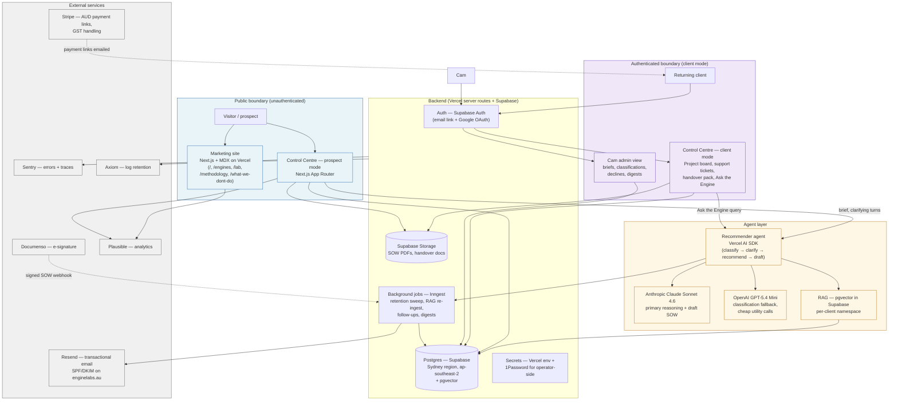

# Engine Labs — Tech Stack v1

A minimum viable stack for shipping the Engine Labs landing page and Control Centre v1.

- Owner: Cam (sole operator)
- Date: May 2026
- Scope: marketing site, Control Centre prospect mode, Control Centre client mode, the supporting plumbing
- Source of feature truth: `../strategy/04-control-centre.md`
- Source of copy and contract constraints: `../strategy/06-copy-rules.md`
- This is an internal build doc. It still follows the copy rules — no enterprise claims, no uptime promises, no outcome guarantees.

---

## 1. Stack principles

Seven rules that decide every tool choice. If a tool fails one of these, it loses.

1. **Smallest viable.** If the next-larger tool only earns its keep at 100x our scale, it stays out. The Pricing Schedule rule applies to our own build first.
2. **One operator must own all of it.** Cam can spin up, configure, deploy, debug and pay for every component without a second person. No tool requires a sales call or a dedicated DevOps body.
3. **The stack is itself a Founder Engine demo.** Every layer is something Engine Labs would happily put in a client's SOW. The Lab post for the Control Centre build is literally the stack on this page.
4. **Clients self-serve common questions.** The handover, the run-book, the "Ask the Engine" RAG and the support ticket form all sit in the Centre so a client can answer their own "how do I…" before emailing Cam.
5. **Honour the Addendum natively.** Data classification, retention, credential hygiene and human-review gates are stack behaviours, not policy PDFs. The default storage TTL, the secret scrubber on brief ingest and the human-review queue are baked in.
6. **No vendor lock-in we can't reverse within a week.** Every vendor either has an open data export, an open-source equivalent we can swap to, or a managed-to-self-host path. The Postgres database is the bedrock; everything else is replaceable around it.
7. **Australian data residency where it materially matters.** Brief content, client documents, handover docs and the RAG corpus sit in `ap-southeast-2` (Sydney). Stateless edge compute and Stripe customer data can sit globally. We say "where it materially matters" because we are not making a residency claim we can't audit.

---

## 2. Architecture overview

The public boundary is everything a visitor can hit without an account. The authenticated boundary requires a Supabase Auth session and a `client` or `admin` role. The agent layer is invoked from both sides — prospects get the recommender, clients get "Ask the Engine" — but it always reads from the database with row-level security scoped to the caller.

---

## 3. Recommended stack — by layer

### 3.1 Web framework and hosting

| Field | Choice |
|---|---|
| Tool | **Next.js 15 (App Router) on Vercel** |
| Why | One codebase for the marketing site, prospect Centre and client Centre. Server actions and route handlers cover all our API needs without a separate backend. The Vercel AI SDK lives natively here. MDX support handles `/lab` posts and Engine spec sheets without a CMS. AU edge presence in Sydney. |
| Cost (AUD, small scale) | A$0 (Vercel Hobby) for week 1 traffic, A$30/month for Vercel Pro once the Centre is live and we want preview environments and team-grade limits. |
| Scale 100x | Same stack. Move to Vercel Pro Plus if we need higher build minutes; otherwise the architecture doesn't change. |
| Not chosen | **Astro** is faster for static marketing but adds a second framework when the Centre needs React anyway. **Remix** is solid but lacks the AI SDK integration. **Plain HTML + HTMX** would force a separate Centre app. **Framer / Webflow** force the marketing site into a tool that can't host the Centre, breaks the "one mental model" rule, and would make the dogfood footer claim ("built with the Founder Engine") harder to substantiate. |

### 3.2 Auth

| Field | Choice |
|---|---|
| Tool | **Supabase Auth** (email magic link + Google OAuth) |
| Why | Lives inside the same Supabase project as the database, so row-level security policies use `auth.uid()` directly without any sync layer. Free up to 50,000 monthly active users. No extra vendor, no extra dashboard, no extra invoice. Honours MFA via TOTP at the user level. |
| Cost (AUD) | A$0 inside the Supabase Pro plan (see 3.3). Magic-link emails go through Supabase or are forwarded through Resend (recommended, see 3.12). |
| Scale 100x | Same. If we ever need enterprise SSO into a client tenant we revisit, but that is firmly out of v1 scope and out of MSA scope (no enterprise). |
| Not chosen | **Clerk** is excellent UX but A$50/month minimum once you cross the free tier, and adds a second user-store that has to sync to the database. **Auth0** is enterprise-priced and overkill. **Lucia** disbanded as a hosted product line in 2025; rolling our own session library is the wrong "smallest viable" tradeoff. |

### 3.3 Database

| Field | Choice |
|---|---|
| Tool | **Supabase Postgres (managed)** in `ap-southeast-2` (Sydney) |
| Why | Postgres is the bedrock; everything we need at v1 is one extension away. Row-level security gives us tenant isolation for free between Cam, each client and the prospect anonymous role. pgvector for RAG (see 3.5). Built-in storage for SOW PDFs and handover docs. Daily backups. Built-in cron via `pg_cron` (see 3.16). |
| Cost (AUD) | A$0 on the free tier for week 1. A$40/month for Supabase Pro once we're live (8 GB DB, 100 GB bandwidth, daily backups, 7-day PITR). |
| Scale 100x | Same Postgres, larger compute add-on; or split RAG out to a dedicated vector store (Turbopuffer) and keep relational data on Supabase. Migration is a `pg_dump` away — no lock-in. |
| Not chosen | **Neon** has excellent branching and serverless cold-start behaviour, but no Sydney region as of May 2026 and no first-class auth/storage. **Turso** is libSQL — fast at the edge but no pgvector path. **PlanetScale** is MySQL, loses the pgvector option, and lacks an obvious AU region. |

### 3.4 LLM providers for the recommender agent

| Field | Choice |
|---|---|
| Primary | **Anthropic Claude Sonnet 4.6** (`claude-sonnet-4-6`) — released February 2026. A$ pricing is set per call by the AUD/USD rate; current published rate is US$3 per million input tokens and US$15 per million output tokens. |
| Fallback | **OpenAI GPT-5.4 Mini** for cheap classification and as a fall-back when Anthropic returns a non-200. Current published rate US$0.75 input / US$4.50 output per million tokens. |
| Not used in v1 | **Google Gemini** — no clear advantage at our scale and adds a third bill. **GPT-5.5** and **Claude Opus 4.7** — overkill for a 5-turn brief recommender; we promote to Opus only on briefs the classifier flags as ambiguous (Risk Tier Amber) and only behind a feature flag. |
| Why this routing | The recommender's three jobs are: (a) classify a brief across four axes (Engine fit, Scope size, Risk tier, Data class — per `04-control-centre.md` P3), (b) hold a tight 3-5 turn clarifying conversation, (c) draft a structured SOW with strict schema. Sonnet 4.6 is best-in-class for instruction following, structured output and safe refusals, all of which matter for the R3/R4 decline paths in `06-copy-rules.md`. Mini handles the cheap classification call so we don't pay Sonnet prices for "did this brief mention a regulated decision?" |
| Cost ceiling per brief | Soft cap A$0.50 per brief in LLM spend. A typical brief = 1 classification call (Mini, ~A$0.005), up to 5 clarifying turns (Sonnet, ~A$0.05 each), 1 SOW draft (Sonnet long output, ~A$0.20). Budget ceiling enforced in the orchestrator: if a single brief exceeds A$0.75 of spend, hand off to Cam. |
| Fallback policy | If Anthropic returns 5xx or rate-limits, retry once after 2s, then fail over to GPT-5.4 Mini with a different system prompt tuned for the same output schema. Both providers' keys live in Vercel env vars, never in code. |

### 3.5 RAG infrastructure for "Ask the Engine"

| Field | Choice |
|---|---|
| Tool | **pgvector inside the Supabase Postgres** (same database as everything else) with HNSW indexes, scoped per client via row-level security. |
| Why | Each client's handover corpus is small — tens to low hundreds of documents, generally well under 100,000 chunks total across the whole portfolio for the foreseeable future. pgvector is free, sits beside the relational data so a single query can join `rag_chunk` to `handover_doc` to `project` to `client`, and tenant isolation comes from the same RLS policies that secure the rest of the database. No second system to authenticate, back up or pay for. |
| Cost (AUD) | A$0 marginal cost on top of Supabase Pro. Embedding generation runs A$0.0001 per chunk on `text-embedding-3-small` via OpenAI; a 100-page handover pack ingests for well under A$0.10. |
| Scale 100x | If a single client's corpus crosses a few million chunks, lift that client's vectors into **Turbopuffer** (object-storage backed, ~US$64/month minimum) and keep the relational data in Postgres. The `rag_chunk` table becomes a pointer table. Documented as a one-day migration. |
| Not chosen | **Pinecone** — managed, but a second vendor, second invoice, second region story, second access control system. **Turbopuffer** is genuinely good but is over-engineered for the v1 corpus size; we have the upgrade path ready. **LanceDB** — fine for local-first, awkward for a multi-client SaaS. |
| Per-client isolation | Every embedding row carries `client_id`. RLS policy: `client_id = auth.jwt() ->> 'client_id'` on the `rag_chunk` table. Cam-side admin role sees everything. There is no shared corpus between clients in v1. |

### 3.6 Agent orchestration

| Field | Choice |
|---|---|
| Tool | **Vercel AI SDK 5.x** (TypeScript), with custom orchestration code for the 5-turn loop and the classification step. |
| Why | The recommender's flow is small enough that a heavier framework is liability rather than help: ingest brief → classify (one structured call) → clarify (up to 5 turns) → draft SOW (one long structured call) → save. The AI SDK gives us `generateObject` with Zod schemas (which we need for the classification axes and the SOW shape), `streamText` for the clarifying chat UI, native tool calling, provider-agnostic routing between Anthropic and OpenAI, and zero framework overhead inside Next.js routes. |
| Cost (AUD) | A$0 (open source). |
| Scale 100x | If the recommender grows multi-agent (e.g. a separate "scoper" agent that critiques the draft SOW), promote to **Mastra** — TypeScript-native, durable workflows, first-class memory and evals, swappable with the AI SDK underneath. Documented as a one-week migration. |
| Not chosen | **Mastra** is the strongest contender, but its durable-workflow primitives and dev UI are overkill for a 5-turn loop and would mean running a second process. We pick it up when we need it. **LangGraph (TS)** — most expressive graph framework but TypeScript port lags Python by 4-8 weeks per release and the Python idioms feel out of place in a Next.js codebase. **Hand-rolled** — what we're effectively doing on top of the AI SDK already; no need to throw away its provider routing and schema helpers. |

### 3.7 PDF generation for draft SOWs

| Field | Choice |
|---|---|
| Tool | **`@react-pdf/renderer`** producing the SOW PDF from a React component in a Vercel server route. |
| Why | The SOW is a structured document with seven fixed sections (Project Snapshot, Business Outcome, Included Deliverables, Exclusions, Milestones, Price, Assumptions — per `04-control-centre.md` P5). A React component mirrors the data shape exactly; layout is deterministic; no headless browser process to host. The watermark ("Draft — not a binding offer until accepted by Engine Labs") is one component prop. |
| Cost (AUD) | A$0 (open source). Vercel function execution is metered with normal route invocations. |
| Scale 100x | Same. If we need richer typography we replace the component, not the runtime. |
| Not chosen | **Puppeteer / Playwright HTML-to-PDF** — a headless browser inside a serverless function is fragile and slow, ~3-5s per render vs ~200ms for react-pdf. **DocRaptor / PDFShift** — pay-per-render, adds a third-party dependency for something we don't need help with. **LaTeX templates** — beautiful, wrong tool for a one-page SOW. |

### 3.8 E-signature

| Field | Choice |
|---|---|
| Tool | **Documenso (managed cloud, Free → Individual plan)** |
| Why | MIT-licensed, TypeScript, PKCS#12 cryptographic signing (matters when the SOW becomes a contract under the Electronic Transactions Act 1999), embeddable signing widget, clean API and webhooks, AU sole-trader friendly. The managed cloud removes the operations burden; the self-host option is the exit ramp if pricing changes. |
| Cost (AUD) | A$0 on the free tier for the first 5 signatures/month, then ~A$45/month on the Individual plan (approx US$30/month converted). Bills in USD. |
| Scale 100x | Self-host Documenso on a small VPS (it's MIT, runs on Postgres which we already have). |
| Not chosen | **DocuSign** — over-priced, enterprise framing contradicts our positioning. **SignWell** — fine product, AU support is okay, but adds a closed-source vendor with no self-host path. **DocuSeal** — cheaper and simpler but AGPL-3.0 (we'd want commercial-friendly licensing on the exit ramp), and its built-in signing is less cryptographically rigorous than Documenso's PKCS#12 chain. |

### 3.9 Payments

| Field | Choice |
|---|---|
| Tool | **Stripe (Australian entity)** — Payment Links emailed separately from the Centre. |
| Why | Default for AU SMB. Native A$ pricing. GST handling via Stripe Tax (turn it on once the ABN is registered for GST — currently optional until turnover crosses A$75,000). Payment Links cover deposit + milestone + final invoices without us hosting a checkout. Webhooks update the `Project.payment_state` in Postgres. |
| Cost (AUD) | Per-transaction: 1.7% + A$0.30 for AU domestic cards, 3.5% + A$0.30 for international cards. Stripe Tax: 0.5% per AU transaction once enabled. No fixed monthly fee. |
| Scale 100x | Same. We never need to host PCI-scoped checkout. |
| Not chosen | **Paddle** — merchant-of-record overkill for a sole trader. **GoCardless** — useful for direct debit on Care plans later; not v1. **Wise / Airwallee** — multi-currency tools, not invoicing tools. |
| AU specifics | All prices on the site show as `A$X (AUD)` per `06-copy-rules.md` R5. Stripe customer is created with `currency: 'aud'`. Once GST-registered, the Engine spec sheet prices remain GST-inclusive; the SOW shows the GST line item explicitly. |

### 3.10 CRM and inbound brief storage

| Field | Choice |
|---|---|
| Tool | **The `brief`, `brief_message`, `classification`, `recommendation` and `client` tables in Supabase Postgres** (i.e. the Control Centre database *is* the CRM). |
| Why | The Centre is the Sales Engine. Putting briefs in a separate CRM duplicates the source of truth and breaks the dogfood story. Cam's admin view (X4 in `04-control-centre.md`) is a simple authenticated Next.js page that queries the same tables the prospect Centre wrote to. |
| Cost (AUD) | A$0 (already covered by Supabase). |
| Scale 100x | If we ever need a sales-pipeline tool with email integration, **Attio** is the cleanest 2026 option (modern data model, good API). For v1 it's a distraction. |
| Not chosen | **Airtable** — pleasant but separate database, sync headaches, no RLS, weak audit trail. **Notion-as-CRM** — fine for a four-deal pipeline; falls over at fifty. **HubSpot / Pipedrive** — vendor weight without payback. |

### 3.11 Email and notifications

| Field | Choice |
|---|---|
| Tool | **Resend** for transactional email; **React Email** for templates. |
| Why | Best-in-class developer experience in 2026, native Next.js support, React Email gives us the same component model we use for the SOW PDF. Resend handles SPF, DKIM and DMARC setup on `enginelabs.au` (or whichever apex we choose — see Open decisions). High deliverability. |
| Cost (AUD) | A$0 for the first 3,000 emails/month, then A$30/month (approx US$20) for 50,000. |
| Scale 100x | Same. Postmark is the warm-standby fallback if Resend ever has an outage. |
| Not chosen | **Postmark** — very strong product, comparable price, slightly older API ergonomics. We'd switch in a day if Resend disappoints. **SendGrid** — bloated. **Mailgun** — fine, not preferred. |
| Outbound under primary domain | `noreply@enginelabs.au` for transactional, `cam@enginelabs.au` for personal replies. Both authenticated via DKIM keys published in Resend's dashboard. DMARC policy starts at `p=quarantine` and tightens to `p=reject` after 30 days of clean reports. |

### 3.12 CMS for `/lab` posts and Engine spec sheets

| Field | Choice |
|---|---|
| Tool | **MDX in the repo** (`/content/lab/*.mdx`, `/content/engines/*.mdx`, `/content/methodology/*.mdx`). |
| Why | The spec sheets already exist as markdown under `strategy/02-engines/`. MDX lets us inline React components (price-band callouts, "configure in the Control Centre" CTAs with brief pre-seeded, video embeds for Lab posts) without leaving the file. Versioned in git. No CMS to log into. Reads like a Lab post about working in plain text — on-brand. |
| Cost (AUD) | A$0. |
| Scale 100x | If we ever bring on a non-engineer content editor, **Sanity** is the cleanest upgrade — pulls from the same MDX into a hosted editor; or **Tina CMS** for editing-in-place against git. For one operator, MDX wins. |
| Not chosen | **Sanity** — overkill for one author. **Notion-as-CMS** — fragile, API rate limits, awkward asset handling. **Contentful** — enterprise pricing. |

### 3.13 Analytics

| Field | Choice |
|---|---|
| Tool | **Plausible (managed cloud, EU region)** |
| Why | Privacy-respecting, no cookies, no consent banner needed under AU privacy law for the marketing site, GDPR/UK/AU compliant by default. Lightweight script (<1 KB) so the Lighthouse score on Engine pages stays clean. Good shareable dashboards for the Lab post "metrics so far" line. |
| Cost (AUD) | A$15/month (approx US$9) for up to 10,000 pageviews. |
| Scale 100x | Same product, higher tier. |
| Not chosen | **Fathom** — equivalent, slightly pricier. **PostHog** — superb product analytics but heavier than we need at v1; revisit once we want funnel analysis on the prospect Centre. **Google Analytics** — privacy-hostile, contradicts the data-class story. |

### 3.14 Error tracking and observability

| Field | Choice |
|---|---|
| Errors + traces | **Sentry** (free tier for v1) |
| Logs | **Axiom** (free tier — 0.5 TB/month ingest) |
| Why | Sentry catches client and server exceptions and traces server-action latency, which is the part of the stack a one-operator can't watch by hand. Axiom takes the structured logs out of Vercel and gives us 30 days of search without paying for Datadog. Both have generous free tiers; both have a self-host or export path if we want to leave. |
| Cost (AUD) | A$0 on both free tiers at v1 traffic. Sentry Team is A$45/month (approx US$29) when we cross the free tier; Axiom paid plans start around A$45/month. |
| Scale 100x | Same products, paid tiers. |
| Not chosen | **Highlight** — good session replay but adds a privacy story we have to defend. **Datadog** — enterprise pricing, against principle 1. **LogRocket** — session replay is more than we need. |
| Honest framing | This is observability for our own debugging. It is not a managed-monitoring service we offer to clients. The MSA §3 and Pricing §5 exclusions on "24/7 monitoring" and "managed DevOps" still hold; if a client wants monitoring on their Engine, that goes in a Support plan SOW or we refer them out. |

### 3.15 Background jobs and scheduling

| Field | Choice |
|---|---|
| Tool | **Inngest (managed cloud)** for event-driven jobs; **Supabase `pg_cron`** for trivial scheduled SQL (retention sweep). |
| Why | Inngest's step-level retry semantics fit LLM workflows perfectly — if the SOW draft step fails, only that step retries, not the entire brief flow. Generous free tier (1,000 runs/month). Local dev parity. Used for: recommender follow-up emails ("you saved a brief 3 days ago, want to refine it?"), RAG re-ingestion when a handover doc updates, the daily admin digest (X4), and the retention sweep cross-check. `pg_cron` handles the 90-day retention SQL because it's a single delete query and Postgres can run it. |
| Cost (AUD) | A$0 free tier; A$30/month (approx US$20) at 10,000 runs once paid. Supabase `pg_cron` is free inside Supabase Pro. |
| Scale 100x | Same Inngest, paid tier. Or migrate to self-hosted Trigger.dev v3 if we need long-running (>15 min) tasks, e.g. large RAG re-ingest. |
| Not chosen | **Trigger.dev** — excellent for long-running tasks but our jobs are sub-minute; Inngest's DX and pricing win at v1. **Vercel Cron** — too primitive (no retry, no observability, no event model). **Pure `pg_cron`** — fine for SQL, no good for "after a brief is classified Sensitive, page Cam and freeze the flow" logic. |

### 3.16 Secrets management

| Field | Choice |
|---|---|
| Tool | **Vercel environment variables** for runtime secrets; **1Password (existing personal vault, business tier — A$12/month)** for the operator-side master list. |
| Why | Vercel's encrypted env vars are the right place for runtime keys (Anthropic, OpenAI, Supabase service role, Stripe, Resend, Documenso, Inngest signing key). 1Password is where Cam stores the master copies, the rotation reminders, and any client-provided credentials before they go into a per-client encrypted store inside the handover record. Honours Addendum §6: no plain-text secrets in repos, no secrets in chat, no shared accounts. Vercel env vars are scoped per environment (development / preview / production). |
| Cost (AUD) | A$0 for Vercel env vars (included). A$12/month for 1Password Business (one seat). |
| Scale 100x | If we ever take on another operator, promote to **Doppler** or **Infisical** so secrets sync centrally across team members. For one operator, the upgrade is unnecessary. |
| Not chosen | **Doppler / Infisical** — fine products, fixed monthly cost for capability we don't need yet. **AWS Secrets Manager** — wrong universe; we're not on AWS directly. **Plain `.env` checked in** — would violate Addendum §6. Not negotiable. |
| Rotation | 90-day rotation reminder in 1Password for: Stripe restricted key, Anthropic key, OpenAI key, Resend API key, Documenso API key, Supabase service role key. Cam-side MFA on all of: Vercel, Supabase, Anthropic, OpenAI, Stripe, Resend, Documenso, GitHub, 1Password itself. |

---

## 4. Data model sketch

Minimum tables for v1. Postgres, snake_case, every table has `id uuid primary key`, `created_at timestamptz default now()`, `updated_at timestamptz`. RLS on every table. No ORM specifics — these are shapes, not migrations.

### `visitor`
Anonymous prospect, optionally captured by email after they save a brief.
- `email` (nullable until captured)
- `consent_to_contact` (bool)
- `first_seen_at`, `last_seen_at`
- `referrer`, `utm_source`, `utm_medium`, `utm_campaign`
- `session_id` (rotates per browser session)

### `client`
A returning client with a project.
- `email` (unique, primary contact)
- `business_name`
- `abn` (nullable)
- `primary_vertical` (enum from `03-verticals.md`)
- `support_plan` (enum: none, basic, standard, priority, ad_hoc)
- `signed_msa_at` (timestamptz, when latest MSA was signed)
- `auth_user_id` (FK → `auth.users`)

### `brief`
A submitted problem statement from the prospect Centre.
- `visitor_id` (FK)
- `client_id` (FK, nullable — set when an existing client submits)
- `raw_input` (text — the original plain-English brief)
- `attachments` (jsonb — Loom URL, screenshot URLs, file refs)
- `status` (enum: drafting, classifying, awaiting_clarification, recommended, declined, saved, abandoned)
- `pii_scrubbed_at` (timestamptz — when the secret-scrubber ran on raw_input before LLM dispatch)
- `expires_at` (timestamptz — 90 days from creation unless the visitor saves it)

### `brief_message`
Each turn in the clarifying conversation.
- `brief_id` (FK)
- `role` (enum: user, agent, system)
- `content` (text)
- `tokens_in`, `tokens_out`, `model` (e.g. `claude-sonnet-4-6`)
- `cost_aud` (numeric — running tally for the per-brief ceiling)
- `turn_index` (int — capped at 5 per P2)

### `classification`
The four-axis classification, one row per brief.
- `brief_id` (FK, unique)
- `engine_fit` (enum: sales, ops, support, insight, founder, knowledge, back_office, outreach, stacked)
- `scope_size` (enum: basic, standard, premium, custom)
- `risk_tier` (enum: green, amber, red)
- `data_class` (enum: public, internal, personal, sensitive)
- `confidence` (numeric 0-1)
- `decline_reason` (text, nullable — populated when risk_tier = red)

### `recommendation`
The agent's structured output for the prospect.
- `brief_id` (FK, unique)
- `summary` (text — what we heard, in the visitor's framing)
- `recommended_engines` (jsonb array)
- `price_band_aud` (jsonb — `{ low: 750, high: 8500 }`)
- `typical_timeline_weeks` (int range)
- `included` (jsonb), `excluded` (jsonb)
- `human_review_note` (text, nullable)

### `draft_sow`
A generated draft SOW PDF.
- `recommendation_id` (FK)
- `pdf_storage_path` (text — Supabase Storage)
- `version` (int — increments on re-generate)
- `inline_edits` (jsonb — section overrides the visitor typed in)
- `watermarked` (bool, default true)

### `project`
A signed engagement.
- `client_id` (FK)
- `engine_type` (enum)
- `sow_version` (int)
- `status` (enum: scoping, building, in_review, handed_over, run_mode, cancelled)
- `current_milestone_id` (FK → `milestone`)
- `payment_state` (enum: deposit_due, deposit_paid, milestone_due, final_due, paid)
- `started_at`, `handed_over_at`

### `milestone`
Per-project delivery milestone.
- `project_id` (FK)
- `name` (text)
- `target_date` (date)
- `amount_aud` (numeric)
- `state` (enum: pending, in_progress, awaiting_review, accepted, paid)
- `stripe_payment_link` (text, nullable)

### `change_request`
A scope change against a signed SOW.
- `project_id` (FK)
- `description` (text)
- `scope_delta` (jsonb — added, removed, modified)
- `price_delta_aud` (numeric)
- `timeline_delta_days` (int)
- `state` (enum: proposed, signed, rejected)

### `support_ticket`
For clients on a Support plan (C4).
- `client_id` (FK), `project_id` (FK)
- `severity` (enum: critical, high, medium, low)
- `description` (text), `reproduction_steps` (text), `attachments` (jsonb)
- `state` (enum: open, in_progress, awaiting_client, resolved, closed)
- `first_response_at`, `resolved_at`
- `support_hours_used_minutes` (int)

### `handover_doc`
A document in a client's handover pack.
- `client_id` (FK), `project_id` (FK)
- `title` (text), `kind` (enum: setup, run_book, credential_rotation, dependency_list, known_limitation, other)
- `storage_path` (text), `mime_type` (text)
- `ingested_to_rag_at` (timestamptz, nullable)
- `version` (int)

### `rag_source`
One row per handover doc that's been embedded.
- `handover_doc_id` (FK)
- `client_id` (FK — for RLS)
- `chunk_count` (int)
- `embedding_model` (text — e.g. `text-embedding-3-small`)
- `last_ingested_at` (timestamptz)

### `rag_chunk`
Embedded chunks.
- `rag_source_id` (FK)
- `client_id` (FK — denormalised for RLS performance)
- `content` (text)
- `embedding` (vector(1536) — pgvector)
- `chunk_index` (int)
- `tokens` (int)

### Cross-cutting
- All tables with a `client_id` have an RLS policy `client_id = (auth.jwt() ->> 'client_id')::uuid OR auth.role() = 'admin'`.
- All tables with a `visitor_id` have an RLS policy `session_id = current_setting('request.jwt.claims', true)::json ->> 'session_id'`.
- `brief.expires_at` is the engine for the 90-day retention sweep (see §7.4).

---

## 5. Cost model

All figures AUD per month at AUD/USD ≈ 0.65, rounded for planning. "Per-brief" is the marginal LLM and email cost only.

### Fixed monthly costs

| Item | Idle | 100 briefs/month | 1,000 briefs/month |
|---|---|---|---|
| Vercel Pro | 30 | 30 | 30 |
| Supabase Pro | 40 | 40 | 60 (small compute add-on) |
| Plausible (managed) | 15 | 15 | 30 (10k pageviews tier) |
| Resend | 0 | 0 | 30 |
| Sentry | 0 | 0 | 45 |
| Axiom | 0 | 0 | 0 |
| Inngest | 0 | 0 | 30 |
| Documenso | 0 | 45 | 45 |
| 1Password Business | 12 | 12 | 12 |
| Domain (`.au`, prorated) | 2 | 2 | 2 |
| **Subtotal fixed** | **A$99** | **A$144** | **A$284** |

All figures in Australian dollars (AUD).

### Per-brief variable costs

A "typical" brief = 1 classification (Mini), 3 clarifying turns (Sonnet 4.6), 1 SOW draft (Sonnet 4.6, longer output), 2 transactional emails, 1 PDF render.

| Component | Per brief |
|---|---|
| Classification (GPT-5.4 Mini, ~1k tokens in / 200 out) | A$0.003 |
| 3 clarifying turns (Sonnet 4.6, ~2k in / 500 out each) | A$0.07 |
| SOW draft (Sonnet 4.6, ~3k in / 1.5k out) | A$0.05 |
| Embedding for retained brief (small) | A$0.001 |
| 2 transactional emails | A$0.001 |
| PDF render (Vercel function time) | A$0.001 |
| **Subtotal variable per brief** | **~A$0.13** |

Soft per-brief ceiling enforced in the orchestrator: A$0.50. Hard ceiling that pages Cam: A$0.75.

### Total at three scale points

| Scale | Fixed | Variable | **Total monthly (AUD)** |
|---|---|---|---|
| Idle (0 briefs) | A$99 | A$0 | **A$99** |
| 100 briefs / month | A$144 | A$13 | **A$157** |
| 1,000 briefs / month | A$284 | A$130 | **A$414** |

### Absolute floor

To keep the Centre live with no briefs at all: **A$99/month AUD**. Strip Plausible if needed (A$84/month). Strip Documenso (it's pay-as-you-go) and keep the Engine page price band conversation off-platform: **A$84/month**. The architecture survives Cam taking a month off.

### What's excluded from the cost model
- Stripe fees — pass through, paid from client revenue.
- Cam's time.
- One-off DNS, ABN registration, accounting software.
- Anthropic / OpenAI prepayment top-ups — handled outside the monthly recurring view.

---

## 6. Build-in-public phasing (4 weeks, one operator)

Each week assumes ~30 focused hours of build time. Lab post at the end of each week documents what shipped and what didn't.

### Week 1 — Marketing site live

**Goal:** publicly visible Engine Labs, no Centre yet. The "configure in the Control Centre" CTA is a styled email-capture stub.

- Buy domain (`enginelabs.au` recommended — see Open decisions). Set Cloudflare nameservers; DNS via Vercel.
- Spin up Next.js 15 + MDX + Tailwind v4 + shadcn/ui repo. Deploy to Vercel Hobby.
- Build the 8 Engine pages from `strategy/02-engines/` (one MDX file each).
- `/methodology` page with all 8 PDFs (intake questionnaire, scope checklist, access checklist, acceptance form, handover checklist, sample SOW, sample change request, sample production sign-off).
- `/what-we-dont-do` long-form, lifted from `05-portfolio-substitutes.md` Substitute 5.
- `/lab` index + Lab post #1: *"Building the Control Centre that built itself."*
- Plausible installed. Sentry on the client + server. SPF/DKIM on `enginelabs.au`.
- Centre CTA replaced with: a styled form, single email field, placeholder copy *"The Control Centre is launching next week. Drop your email and you'll be first in."* Email lands in `brief.raw_input` with `status='abandoned'` and a flag for the Week 2 outreach.

**Satisfies from `04-control-centre.md`:** X1 (`/what-we-dont-do` link in header), X2 (dogfood line on the placeholder, pointing to Lab post #1 with the SOW).
**Deferred:** all of P1-P8, all of C1-C7, X3, X4.

### Week 2 — Control Centre prospect mode (no SOW PDF yet)

**Goal:** brief input → clarifying turns → recommendation. Visitor can save the brief by email. No PDF, no e-sign, no decline-as-PDF.

- Supabase project provisioned in `ap-southeast-2`. Schema: `visitor`, `brief`, `brief_message`, `classification`, `recommendation`. RLS policies. `pg_cron` job for 90-day sweep.
- Recommender agent: Vercel AI SDK, Zod schemas for the four classification axes and the `recommendation` shape. System prompt drawn from `build/recommender-prompt.md` (to be written this week).
- Anthropic + OpenAI keys in Vercel env. Per-brief cost meter in `brief_message.cost_aud`.
- Brief input UI (P1), clarifying conversation UI (P2, hard cap 5 turns), classification (P3, server-side, silent), recommendation card (P4).
- Red-tier decline path (P7), low-confidence "let's chat" path (P8). Text drawn from `06-copy-rules.md`.
- Data-class warning on the input field, per X3.
- "Save my brief" (email capture, `visitor.email`, sets `expires_at = null`) and "Talk to Cam" (Cal.com link) work. "Refine" loops back into the conversation.

**Satisfies:** P1, P2, P3, P4, P6 (Save, Talk, Refine, Leave — the four next-steps), P7, P8, X3.
**Deferred:** P5 (SOW draft + PDF), C1-C7, X4.

### Week 3 — Draft SOW + PDF + actions

**Goal:** the recommendation produces a real, downloadable, watermarked draft SOW. Stripe Payment Links are wired but live separately (Cam emails them).

- `draft_sow` table; Supabase Storage bucket `sow-drafts`.
- React-PDF component with the seven-section SOW template. Watermark "Draft — not a binding offer until accepted by Engine Labs."
- Inline edit UI: visitor can override any section's text and click "regenerate" — the agent re-drafts using the edits as constraints, increments `draft_sow.version`.
- Stripe AU entity created, currency AUD, GST registered if turnover or readiness demands it. Three sample Payment Links built (deposit, milestone, final) so they're ready when a Week 3 brief converts.
- Documenso account created, template uploaded for the MSA + SOW combo. Embeddable widget tested but linked-out rather than embedded inside the Centre for v1 (per `04-control-centre.md` exclusions list).
- Admin view (X4) v1: Cam-only authenticated page listing the day's briefs, classifications, declines.
- Daily digest email at 6pm Sydney time via Inngest.

**Satisfies:** P5, X4.
**Deferred:** C1-C7.

### Week 4 — Client mode minimum

**Goal:** auth, project board, support ticket form, handover pack view. "Ask the Engine" deferred to v1.1.

- Supabase Auth: email magic link primary, Google OAuth secondary. MFA TOTP available, encouraged on the first sign-in screen.
- `client`, `project`, `milestone`, `change_request`, `support_ticket`, `handover_doc` tables. RLS scoped to `auth.uid()`.
- C1 project board: row per project, status, milestone, payment_state.
- C2 saved briefs view: lists briefs where `visitor.email = client.email`.
- C3 SOW + change request log.
- C4 support ticket form: severity, description, attachments. Shows the response targets from the client's plan (or "no plan" honestly).
- C5 handover pack view: lists `handover_doc` rows, downloads from storage.
- C7 production sign-off form (Addendum §11): a single form route saving to a `production_signoff` table.
- Footer dogfood line on the live Centre now points to the real SOW in Lab post #1.

**Satisfies:** C1, C2, C3, C4, C5, C7.
**Deferred to v1.1:** C6 ("Ask the Engine" RAG over per-client handover docs) — defer because the RAG ingestion pipeline (chunking, embedding, evaluation, citation UI) is its own week of work and the value only kicks in once at least one client has a handover pack worth searching.

### v1 launch checklist (end of week 4)

- All 8 Engine pages live.
- `/methodology`, `/what-we-dont-do`, `/lab` with at least 4 posts.
- Prospect Centre: P1-P8 (P3 silent), P6 four-actions, X1, X2, X3, X4.
- Client Centre: C1, C2, C3, C4, C5, C7.
- Explicitly deferred (with a Lab post explaining why): C6 (Ask the Engine RAG), real-time SOW collab, mobile app, in-Centre payments — all of which match the `04-control-centre.md` "what v1 explicitly does not include" list, except C6 which we add to the deferred list.

---

## 7. Honouring the Addendum in the stack

How each Addendum requirement is satisfied by the technology, not just by policy.

### 7.1 Data classification (§2) → recommender classifies on every brief
- `classification.data_class` is one of `public`, `internal`, `personal`, `sensitive`.
- Set as part of the silent classification call (P3) before any clarifying turn runs.
- If `data_class = 'sensitive'`, the orchestrator short-circuits the conversation. The visitor sees: *"This brief looks like it involves sensitive information. Engine Labs handles this through a human conversation, not an auto-quote. Want to book a call with Cam?"* No further LLM call is made on the brief's content.
- If `data_class = 'personal'` and `risk_tier = 'amber'`, the recommender continues but the draft SOW includes a Personal Information clause from the SOW template and Cam is notified before the draft is shown to the prospect.

### 7.2 Data minimisation (§3) → scrub before send, scope at storage
- A secret-scrubber runs on `brief.raw_input` before any LLM call. Detects: API keys (regex by provider), bearer tokens, JWTs, AWS access keys, credit card numbers (Luhn check), Australian TFNs, Medicare numbers, ABNs in suspicious contexts. Replaced with `[REDACTED:TYPE]`. The original is **not** persisted; only the scrubbed version is stored. `brief.pii_scrubbed_at` records when this ran.
- Client briefs from inside Client Mode that touch their own production data still don't get sent to LLMs unless the SOW for that project explicitly permits LLM processing of that data class. The `project.llm_data_clauses` jsonb stores the per-project permissions.
- Brief input UI carries the X3 warning, but the scrubber is the technical control. Trust the regex, not the visitor.

### 7.3 Credential hygiene (§6) → no plain text anywhere
- Operator-side: 1Password Business as master vault. Every account (Vercel, Supabase, Anthropic, OpenAI, Stripe, Resend, Documenso, GitHub, Inngest, Plausible, Sentry, Axiom, the domain registrar) has its credentials and recovery codes in 1Password. MFA via TOTP or hardware key on every account that supports it.
- Runtime: secrets in Vercel encrypted env vars only. Never committed. `git-secrets` pre-commit hook in the repo. Three environments (development, preview, production) with different keys.
- Client-side: when a client gives us a credential (e.g. an API key for their Engine to use), it lands in an encrypted column on `handover_doc` (using `pgcrypto`), gets surfaced once in the handover view, and is then opaque to Cam unless he explicitly decrypts it for troubleshooting. Rotation is a documented step in the handover pack.

### 7.4 Retention (§9) → 90-day default, scheduled sweep
- Every `brief`, `brief_message`, `classification`, `recommendation` and `draft_sow` row has `expires_at = created_at + 90 days` by default.
- The visitor saving the brief (P6 "Save my brief, email me a copy") sets `expires_at = null`, making it permanent until the visitor revokes.
- A `pg_cron` job runs daily at 02:00 Sydney time: `DELETE FROM brief WHERE expires_at < now()`. Cascading deletes remove the related `brief_message`, `classification`, `recommendation`, `draft_sow` rows and their storage objects. Inngest cross-checks the storage bucket nightly for orphan PDFs and removes them.
- Client-mode data (`project`, `handover_doc`, `support_ticket`) retains for the life of the engagement plus the period specified in the MSA (default 12 months post-handover unless the client requests earlier deletion).
- Privacy page documents this verbatim.

### 7.5 Incident handling (§8) → minimum viable playbook
- **What logs are kept:** Vercel function logs (Axiom ingest, 30 days), Sentry error events (90 days on free tier), Supabase audit log of admin actions (forever, single-table), Inngest run history (30 days).
- **Where:** Axiom (logs), Sentry (errors), Supabase (audit table `admin_action_log`).
- **Incident playbook (one page in `/build/incident-playbook.md`, week 1 deliverable):**
  1. Detect (Sentry alert, client report, or Cam's own discovery).
  2. Triage within 4 hours during AU business hours, 24 hours otherwise. (Note: this is an internal target, not a published commitment — the SLA Addendum's response targets are the only public ones.)
  3. Contain (rotate the suspect credential, disable the affected user/key, take the Centre to maintenance mode if needed).
  4. Assess scope (which clients, which data classes, which records).
  5. Notify affected clients in plain English within 72 hours if Personal or Sensitive data was involved, per OAIC Notifiable Data Breaches scheme.
  6. Document in an internal post-incident note (Lab post if the lesson is shareable).
  7. Implement the fix and the regression check.
- We do not claim 24/7 incident response. We claim a process.

### 7.6 Practical security baseline (§10) → MFA, scoping, rotation, no repo secrets
- MFA on every account that supports it. TOTP via 1Password.
- Separate client/project access at the database level — RLS scoped to `client_id`. Cam-side admin role bypasses RLS but every admin query is logged to `admin_action_log`.
- Rotation: 90-day reminder for runtime keys (Anthropic, OpenAI, Stripe restricted, Resend, Documenso, Supabase service role). 365-day for refresh tokens.
- No secrets in repos. `git-secrets` pre-commit hook. CI fails if `.env` is committed.
- Vercel preview environments use a separate set of keys with lower limits, so a preview leaking a key in a log doesn't cost real money.

---

## 8. Out of scope for v1

What we are deliberately not building, with rationale.

| Out of scope | Rationale |
|---|---|
| **Real-time collaborative editing on SOWs** | Single-operator studio; no client has asked for it; would require Yjs/Liveblocks and a much heavier UI. Save-and-regenerate is enough. |
| **Mobile-native app** | Responsive web covers every Centre interaction. The Engines themselves run in clients' tools, not ours — there is nothing a mobile app would unlock. |
| **In-Centre payment processing** | Stripe Payment Links emailed separately is the explicit `04-control-centre.md` rule. Avoids PCI scope, avoids checkout maintenance, keeps the Centre's job narrow. |
| **Multi-language** | Australian English only at launch. No client in the target verticals is asking for translations. |
| **In-Centre integrations into client tools** | The Centre is a portal, not a runtime. The Engines run wherever the client's tools live. The "configure in your Salesforce" temptation is a different product. |
| **Public showcase of other clients' briefs or SOWs** | MSA §14 confidentiality. The Lab posts are synthetic case studies Engine Labs fully owns; that's the substitute. |
| **"Ask the Engine" RAG (C6)** | Deferred to v1.1. The chunking pipeline, evaluation harness, citation UI and re-ingestion job are a clean week of work and add no value until at least one real handover pack exists. The fallback "open a support ticket" form in C4 covers the question-asking surface until C6 ships. |
| **Multi-tenant Engine instances within a single client account** | One client = one account in v1. A client with two distinct Engines sees two projects in the same account. Multi-workspace, role-based collaboration, audit-per-collaborator are all v2 territory. |
| **A staff/agent admin console for anyone other than Cam** | Single operator. The admin view is one route, gated to the `admin` role. The day a second operator joins is the day we revisit. |
| **Managed monitoring or 24/7 alerting for client Engines** | MSA §3 and Pricing §5 explicitly exclude this. If a client wants it, they buy a Care plan that includes it or we refer them to a managed services provider. |

---

## 9. Open decisions — RESOLVED

The 8 questions below were answered by Cam in May 2026. The original recommendations are preserved for context; the *Resolved* line is what the build uses.

1. **Trading entity and ABN.** Recommendation was: register a business name now; defer Pty Ltd until annual turnover crosses A$75k. **Resolved:** Australian sole trader trading as Cam Douglas (ABN **13 141 459 638**), governing law **New South Wales**. The "Engine Labs" business name is being registered on the ABR alongside the sole trader registration.

2. **Primary apex domain.** Recommendation was: `enginelabs.au`. **Resolved: `enginelabs.com.au`** (already registered). Cam preferred the traditional AU framing.

3. **AU vs US Stripe account.** Recommendation was: AU. **Resolved: AU.** Cam to set up shortly. Until then, Stripe integration is stubbed in the Week 1 site.

4. **LLM account model.** Recommendation was: single Engine Labs Anthropic + OpenAI account with per-client logical separation. **Resolved: single Engine Labs account routed via [OpenRouter](https://openrouter.ai/), using `anthropic/claude-opus-4.7` as the primary model, with per-session and per-day rate limits enforced in the orchestrator.** This replaces direct Anthropic + OpenAI accounts. Implication: the orchestration layer talks to one OpenRouter API surface and the model can be swapped via a config string without a code change. Fallback model (utility / cheap classification) is still TBD — recommend `openai/gpt-5.4-mini` via the same OpenRouter account until evidence suggests otherwise.

5. **MFA hardware.** Recommendation was: YubiKey on critical accounts + TOTP elsewhere. **Resolved: as recommended.** YubiKey on Vercel, Supabase, Stripe and the domain registrar; TOTP via 1Password everywhere else.

6. **Production data residency for handover docs.** Recommendation was: Sydney default. **Resolved: as recommended.** Supabase project in `ap-southeast-2` (Sydney). State "stored in Sydney by default" on `/privacy`. Revisit only when a real client requires strict AU-only with attestation.

7. **Email primary address.** Recommendation was: `cam@enginelabs.au` with `hello@` forwarding. **Resolved: `hello@enginelabs.com.au`** as the primary public contact. Cam-direct addresses can be added later as the team scales beyond one operator.

8. **Lab post #1 cadence trigger.** Recommendation was: Part 1 end Week 1 + Part 2 end Week 4. **Resolved: as recommended.** Part 1 skeleton lives at `docs/lab/001-building-the-control-centre-that-built-itself.md`. Part 2 ships at end of Week 4 when the Centre is genuinely live.

### Stack changes triggered by these answers

- Replace any reference to "Anthropic direct" and "OpenAI direct" in §3 with "OpenRouter as the gateway, `anthropic/claude-opus-4.7` as the primary model".
- Domain everywhere updated to `enginelabs.com.au`.
- Public email everywhere updated to `hello@enginelabs.com.au`.
- Entity disclosure line (used in footer, /about, /privacy, /terms): *"Engine Labs is an Australian sole trader trading as Cam Douglas (ABN 13 141 459 638), governed by the laws of New South Wales."*

---

## Appendix: tools cheat sheet

| Layer | Tool | Plan | A$/month at v1 |
|---|---|---|---|
| Hosting | Vercel Pro | Pro | 30 |
| Database + Auth + Storage + Vectors | Supabase | Pro, Sydney | 40 |
| LLM (primary) | Anthropic Claude Sonnet 4.6 | API | Per use |
| LLM (utility / fallback) | OpenAI GPT-5.4 Mini | API | Per use |
| Agent orchestration | Vercel AI SDK | OSS | 0 |
| PDF generation | `@react-pdf/renderer` | OSS | 0 |
| E-signature | Documenso Cloud | Individual | 45 |
| Payments | Stripe AU | Standard | Per txn |
| Email | Resend | Free → Pro | 0 → 30 |
| CMS | MDX in repo | OSS | 0 |
| Analytics | Plausible Cloud | 10k | 15 |
| Errors | Sentry | Developer (free) | 0 |
| Logs | Axiom | Free | 0 |
| Background jobs | Inngest | Free | 0 |
| Scheduled SQL | Supabase `pg_cron` | Included | 0 |
| Secrets (operator) | 1Password Business | Business | 12 |
| Domain | `.au` registrar | Annual | ~2 |
| **Absolute floor** |  |  | **~A$99/month AUD** |

All figures Australian dollars (AUD). LLM and Stripe costs are pay-per-use and not included in the floor.

---

*End of document. Last revised May 2026. Next review: once the recommender has classified 100 briefs in production, or at the end of v1.1, whichever comes first.*
