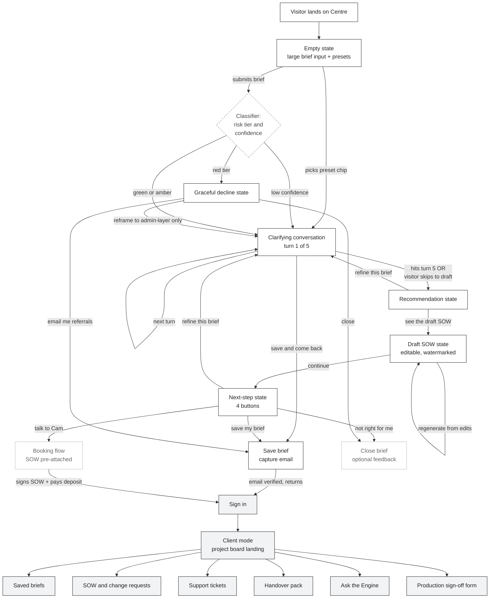

# Engine Labs Control Centre — Wireframe v1

> Companion to `../strategy/04-control-centre.md`. Source of truth for screen-level layout and on-screen copy. Cite this file when building Figma or a coded prototype.

---

## 1. Overview

This document wireframes the **Engine Labs Control Centre** — the single AI-powered interface that does double duty as (a) the public-facing brief-to-SOW funnel for visitors (**prospect mode**), and (b) the authenticated client project portal for paying clients (**client mode**). One interface, one mental model: the first thing a visitor does with Engine Labs is *use* Engine Labs, and that same surface becomes their project portal once they sign. Both modes ship in v1, share the same chrome (header, footer, dogfood line, "what we don't do" link), and re-use the same conversational primitives.

**What this file covers.** Screen-level ASCII wireframes, callout annotations tying each screen back to `04-control-centre.md` features (P1–P8, C1–C7, X1–X4) and `06-copy-rules.md` rules (R1–R10, V1–V4); the prospect-to-client state transitions; mobile collapse rules.

**What this file does *not* cover.** Page-level information architecture for the rest of the marketing site (hero, Engine spec sheets, vertical pages, /lab, exclusions page, about) — that lives in the sibling doc `page-ia-copy.md`. Recommender prompt logic and classifier system prompt live in `recommender-prompt.md`. Tech-stack choices live in `tech-stack.md`. Visual design (colour, type, spacing) is downstream of this wireframe and not specified here.

---

## 2. Prospect mode wireframes

All prospect-mode screens render inside the **Centre shell** (see §4). The shell is omitted from the screens below for legibility, except where a callout depends on it.

### 2.1 Empty state — first land

The visitor's first impression. One large input, no chrome competing with it, presets below as low-friction starters.

```
┌──────────────────────────────────────────────────────────────────────────────┐
│                                                                              │
│   What's slowing your business down?                                  (1)    │
│   We'll draft a solution for you.                                            │
│                                                                              │
│   ┌────────────────────────────────────────────────────────────────────┐     │
│   │                                                                    │     │
│   │   Describe the work you'd rather not hire for.                     │ (2) │
│   │                                                                    │     │
│   │                                                                    │     │
│   │   [ paperclip ] attach a Loom, screenshot or spreadsheet           │ (3) │
│   │                                                                    │     │
│   │                                                       [ Start →  ] │     │
│   └────────────────────────────────────────────────────────────────────┘     │
│                                                                              │
│   Don't paste secrets, API keys or sensitive personal information.    (4)    │
│                                                                              │
│                                                                              │
│   Or start from an example:                                           (5)    │
│                                                                              │
│   ( Plumber missing leads )   ( Agency drowning in status reports )          │
│   ( Founder needs an MVP for an investor demo )                              │
│   ( Shopify support inbox overwhelmed )   ( Recruiter buried in CVs )        │
│   ( Coach onboarding new clients )                                           │
│                                                                              │
└──────────────────────────────────────────────────────────────────────────────┘
```

**Callouts**

1. **Headline + sub-headline.** Headline is the operator-grade question (V1 plain English, V2 verbs over adjectives). Sub-headline is the placeholder copy locked in P1 — "What's slowing your business down? We'll draft a solution for you." — promoted to a heading so the input itself can carry inline microcopy. Avoids the forbidden "AI-powered solutions" framing (R1, retire list).
2. **Single focused input field.** P1: one input, large and central. No competing CTA above the fold. Inline placeholder is *"Describe the work you'd rather not hire for."* — Lane C verb of substitution, per `01-positioning.md`.
3. **Optional attachment slot.** Per P1: Loom links, screenshots, spreadsheets. Optional, never required. No "drag and drop your data lake" framing — small, lo-fi, fits the studio voice.
4. **Data hygiene warning (X3 + R10).** Always present above or beneath the input. Mirrors Addendum §2 / §9 in plain English. This is not fine print — same type size as body copy.
5. **Preset chips, sourced from the six verticals (`03-verticals.md`).** Six chips, one per vertical, pre-seeded with the example brief from that vertical's spec. Honours V3 (examples over claims) by letting the visitor *see* the kind of brief that works here. Deliberately omitted: industry chips for healthcare, law, finance — those would invite red-tier briefs (R3).

---

### 2.2 Clarifying-conversation state — turn 2 of 5

Chat-like, but capped. Visitor can always escape to a draft. The progress dots make the cap visible so the visitor doesn't feel interrogated.

```
┌──────────────────────────────────────────────────────────────────────────────┐
│  Brief in progress                              Turn 2 of 5   ● ● ○ ○ ○ (1)  │
│  ──────────────────────────────────────────────────────────────────────────  │
│                                                                              │
│  You                                                                         │
│  ┌────────────────────────────────────────────────────────────────────┐ (2)  │
│  │ I'm a plumber. I miss leads when I'm on the tools. I want every    │      │
│  │ enquiry caught and a draft reply ready in my phone.                │      │
│  └────────────────────────────────────────────────────────────────────┘      │
│                                                                              │
│  Engine Labs                                                                 │
│  ┌────────────────────────────────────────────────────────────────────┐ (3)  │
│  │ Got it. Two quick ones so we draft something useful:               │      │
│  │                                                                    │      │
│  │ 1. Where do the enquiries land today — your website form, a phone  │      │
│  │    number, Google business profile, all three?                     │      │
│  │ 2. Roughly how many a week, and what's the rough job size mix      │      │
│  │    (small repairs vs. install jobs)?                               │      │
│  └────────────────────────────────────────────────────────────────────┘      │
│                                                                              │
│  You                                                                         │
│  ┌────────────────────────────────────────────────────────────────────┐      │
│  │ Website form + Google + phone. About 15 a week. Mostly small       │      │
│  │ repairs, maybe 2 install jobs a month.                             │      │
│  └────────────────────────────────────────────────────────────────────┘      │
│                                                                              │
│  Engine Labs is thinking …                                            (4)    │
│                                                                              │
│  ──────────────────────────────────────────────────────────────────────────  │
│  ┌────────────────────────────────────────────────────────────────────┐      │
│  │ Reply to Engine Labs …                                             │ (5)  │
│  │                                                              [Send]│      │
│  └────────────────────────────────────────────────────────────────────┘      │
│  Don't paste secrets, API keys or sensitive personal information.            │
│                                                                              │
│  [ Skip to draft now → ]            [ Save this brief and come back ] (6)    │
└──────────────────────────────────────────────────────────────────────────────┘
```

**Callouts**

1. **Turn counter, visible.** P2: hard cap of 5. Showing the dots prevents the conversation feeling open-ended. Honours V1 (direct, plain) — no "tell us a bit about you!" wheedling.
2. **User turn — visitor's own words echoed back.** P4 will later summarise "what the agent heard, in the visitor's own framing"; keeping the raw transcript visible makes that promise testable on the next screen.
3. **AI turn — two questions max per turn.** Questions adapt to brief content (P2). Drawn from the Client Intake Questionnaire (Handover Pack §1) but rephrased plain. Never makes scope/price claims yet — P2 says the agent does *not* assume scope, price or feasibility until clarification is complete (avoids breaching R1 / R5 prematurely).
4. **Thinking indicator, not a loading spinner.** Sets the expectation that this is a person-shaped agent, not a database lookup. Single line, no animations beyond the ellipsis.
5. **Reply field carries the same data-hygiene warning.** R10 must appear on every input surface, not just the first.
6. **Two escape hatches.** *Skip to draft now* honours P6's "no friction" principle and supports P8 ("honest I don't know" — visitor can see a draft even if classifier confidence is low). *Save this brief and come back* captures email per P6 / C2, no commitment. Deliberately omitted: a "talk to a human now" button — that lives on the recommendation screen where the agent has enough context to brief Cam.

---

### 2.3 Recommendation state

The agent's read-back of the brief, the recommended Engine(s), the price band, the timeline, and — equally prominent — what's *not* in scope.

```
┌──────────────────────────────────────────────────────────────────────────────┐
│  Recommendation                                              Brief #BR-0142  │
│  ──────────────────────────────────────────────────────────────────────────  │
│                                                                              │
│  Here's what we heard                                                 (1)    │
│  ┌────────────────────────────────────────────────────────────────────┐      │
│  │ You're a plumber doing ~15 enquiries a week across a website       │      │
│  │ form, Google business profile and a phone line. You're losing      │      │
│  │ jobs because you can't reply fast enough while you're on the       │      │
│  │ tools.                                                             │      │
│  └────────────────────────────────────────────────────────────────────┘      │
│                                                                              │
│  Recommended Engine                                                   (2)    │
│  ┌────────────────────────────────────────────────────────────────────┐      │
│  │  Sales Engine — Standard tier                                      │      │
│  │  Replaces the work of: a junior inbound coordinator.               │      │
│  │                                                                    │      │
│  │  Why this fits: your enquiries already land in tools the Sales     │      │
│  │  Engine plugs into (web form, Google, SMS). Standard tier covers   │      │
│  │  intake + qualification + drafted reply with your one-click send.  │      │
│  └────────────────────────────────────────────────────────────────────┘      │
│                                                                              │
│  Price band            from A$1,800 AUD     scoped in the Centre      (3)    │
│  Typical timeline      2–3 weeks                                             │
│                                                                              │
│  What we'd need from you                                              (4)    │
│   • Read access to your website form provider and Google profile.            │
│   • Sample of your last 20 enquiries (de-identified is fine).                │
│   • 30 minutes to record how you'd reply to five real ones.                  │
│                                                                              │
│  What's not included                                                  (5)    │
│   • Auto-sending replies to customers without your sign-off (R2).            │
│   • Outbound cold messaging to anyone you don't already have                 │
│     permission to contact (R9).                                              │
│   • Plumbing-specific job-pricing or quoting logic — that's a                │
│     separate scoping conversation.                                           │
│                                                                              │
│  Sensitive areas in this brief: none flagged.                         (6)    │
│                                                                              │
│           [ See the draft SOW → ]       [ Refine this brief ]                │
└──────────────────────────────────────────────────────────────────────────────┘
```

**Callouts**

1. **"Here's what we heard" panel.** P4 spec: "a summary of what the agent heard, in the visitor's own framing." Uses the visitor's verbs ("on the tools", "losing jobs"), not Engine Labs jargon. Lets the visitor catch misinterpretation before reading the SOW.
2. **Engine recommendation card.** Engine name from the locked catalog (`02-engines/README.md`). "Replaces the work of" line matches the spec sheet template item 2. Single sentence "why this fits" — no adjective stacking (V2).
3. **Price band copy.** *"from A$1,800 AUD scoped in the Centre"* — Sales Engine Standard tier starting price (matches `02-engines/sales-engine.md`). Honours R5 verbatim: A$ prefix, the word "from", AUD spelled out at least once per pricing block, and the scoping path made explicit. No promise of fixed price for any project (R5 forbidden list).
4. **"What we'd need from you" — three bullets.** Mirrors the Engine spec sheet "Inputs" section. Sets expectation that this is a collaborative build, not a black box.
5. **"What's not included" — explicit exclusions.** Required by P4. Each exclusion cites the rule it honours so a reviewer can trace it: R2 (human review), R9 (consent-gated outreach). V4 — boundaries shown, not hidden.
6. **Sensitive-area note.** P4 + X3. If the classifier flagged sensitive data class (Addendum §2) or an amber-tier brief, this line becomes a callout banner with a "let's do this on a call" CTA instead of the SOW button. On a green-tier brief like this one, it stays low-key.

---

### 2.4 Draft SOW state

A one-page editable SOW that mirrors the SOW Template in the contract pack. Watermarked, inline-editable, downloadable.

```
┌──────────────────────────────────────────────────────────────────────────────┐
│  Draft Statement of Work                          Brief #BR-0142     [PDF] (1)│
│  ──────────────────────────────────────────────────────────────────────────  │
│                                                                              │
│  ╔════════════════════════════════════════════════════════════════════╗     │
│  ║                  DRAFT — not a binding offer                       ║ (2)  │
│  ║                until accepted in writing by Engine Labs.           ║     │
│  ╚════════════════════════════════════════════════════════════════════╝     │
│                                                                              │
│  Project Snapshot                                          [ edit ]   (3)    │
│   Plumbing inbound capture and reply-drafting Engine.                        │
│   One operator. Sydney-based trade business.                                 │
│                                                                              │
│  Business Outcome (intended)                               [ edit ]   (4)    │
│   You aim to stop losing jobs that come in while you're on the tools,        │
│   by catching every enquiry across web, Google and phone, and having a       │
│   drafted reply ready in your phone for one-click send.                      │
│                                                                              │
│  Included Deliverables                                     [ edit ]   (5)    │
│   1. Intake capture across website form, Google profile and SMS into a       │
│      single queue.                                                           │
│   2. Qualification step (job type, urgency, suburb, contact) drafted by      │
│      the Engine.                                                             │
│   3. First-reply draft in your voice, ready in your phone for one-click      │
│      send. Human review baked in.                                            │
│   4. Daily digest of the previous day's enquiries.                           │
│   5. Run-book and handover pack on acceptance.                               │
│                                                                              │
│  Exclusions                                                [ edit ]   (6)    │
│   • No auto-sending of replies to customers (Addendum §4 / MSA §12).         │
│   • No cold outreach to leads you don't already have permission to           │
│     contact (Addendum §7).                                                   │
│   • No quoting / pricing logic for plumbing jobs (separate scope).           │
│   • No 24/7 monitoring or production-grade SRE (MSA §3).                     │
│                                                                              │
│  Milestones                                                [ edit ]          │
│   M1  Scope sign-off + access provisioning        Week 0                     │
│   M2  Intake + qualification working end-to-end   Week 1                     │
│   M3  Reply drafts tuned on your real enquiries   Week 2                     │
│   M4  Acceptance + handover                       Week 2–3                   │
│                                                                              │
│  Price                                                     [ edit ]   (7)    │
│   from A$1,800 AUD. Final scope confirmed before sign-off. Larger or         │
│   ambiguous changes go through a paid scoping workshop.                      │
│                                                                              │
│  Assumptions                                               [ edit ]          │
│   • You have admin access to the website form, Google profile and phone.     │
│   • Third-party tools (form provider, AI model, SMS gateway) keep their      │
│     current APIs and pricing. We'll flag and re-quote if they change.        │
│   • Defect-fix period: 14 days from acceptance (SLA §2). Ongoing             │
│     support is a separate Care plan if you want it.                          │
│                                                                              │
│  ──────────────────────────────────────────────────────────────────────────  │
│  [ Regenerate from edits ]         [ Download PDF ]    [ Continue → ]        │
└──────────────────────────────────────────────────────────────────────────────┘
```

**Callouts**

1. **PDF download in the header.** P5: "Downloadable as PDF." Top-right placement so it's reachable without scrolling.
2. **Watermark, prominent.** P5 spec wording: *"Draft — not a binding offer until accepted by Engine Labs."* Rendered as a visible banner, not a faint background image — Australian-voice direct (V1). Honours R1 (no outcome guarantees, no implied commitment).
3. **Project Snapshot.** Section #1 of the SOW Template. Plain, concrete, no buzzwords.
4. **Business Outcome — phrased as intent, not guarantee.** Copy uses "you aim to" and "intended" — directly honours R1 allowed alternatives ("designed to", "intended to"). Never "we'll double your jobs won".
5. **Included Deliverables — numbered, concrete.** Every deliverable is a noun the visitor can point at. Item 3 explicitly says "Human review baked in" (R2 allowed phrasing). No "set and forget".
6. **Exclusions section — cites contract clauses inline.** R2/MSA §12, R9/Addendum §7, R4/MSA §3. This is the trust accelerator from V4 — exclusions treated as marketing copy, not fine print.
7. **Price — exact copy template.** "from A$X AUD … larger or ambiguous changes go through a paid scoping workshop" lifted from R5 allowed alternatives. Inline-editable but the *format* is enforced (the editor wraps any user edit in the same template).

---

### 2.5 Next-step state

Four buttons, equally weighted, no dark patterns. Saved on the same screen as the SOW so the visitor never feels routed into a funnel.

```
┌──────────────────────────────────────────────────────────────────────────────┐
│  What would you like to do next?                            Brief #BR-0142   │
│  ──────────────────────────────────────────────────────────────────────────  │
│                                                                              │
│   ┌────────────────────────┐    ┌────────────────────────┐                   │
│   │  Save my brief         │    │  Talk to Cam           │                   │
│   │                        │    │                        │                   │
│   │  Email me a copy of    │ (1)│  Book a 30-minute      │ (2)               │
│   │  the brief and draft   │    │  discovery call.       │                   │
│   │  SOW. No commitment.   │    │  The draft SOW comes   │                   │
│   │                        │    │  in with you.          │                   │
│   │  [ Email me →       ]  │    │  [ Pick a time →    ]  │                   │
│   └────────────────────────┘    └────────────────────────┘                   │
│                                                                              │
│   ┌────────────────────────┐    ┌────────────────────────┐                   │
│   │  Refine this brief     │    │  Not right for me      │                   │
│   │                        │    │                        │                   │
│   │  Go back into the      │ (3)│  Tell us why if you'd  │ (4)               │
│   │  clarifying loop and   │    │  like. No follow-up    │                   │
│   │  adjust the scope.     │    │  email, no pressure.   │                   │
│   │                        │    │                        │                   │
│   │  [ Keep refining →  ]  │    │  [ Close brief      ]  │                   │
│   └────────────────────────┘    └────────────────────────┘                   │
│                                                                              │
│  ──────────────────────────────────────────────────────────────────────────  │
│  Reminder: this is a draft. Nothing's binding until we both sign.      (5)   │
└──────────────────────────────────────────────────────────────────────────────┘
```

**Callouts**

1. **Save my brief.** P6 verbatim. Captures email only. Per X3, this is the opt-in that promotes the brief from session storage to persistent storage (Addendum §9 retention applies until the visitor opts in by saving).
2. **Talk to Cam.** P6 verbatim — uses the operator's name, not "talk to sales", which would breach V1 (operator voice, not vendor voice). The draft SOW pre-attaches to the calendar invite so Cam walks in primed.
3. **Refine this brief.** P6 verbatim. Sends the visitor back to §2.2 with the existing transcript intact.
4. **Not right for me.** P6 verbatim. Critical: this is a real button, not a "× close" in the corner. Honours the V4 "show the boundaries" voice — a visitor who self-disqualifies is a good outcome.
5. **Re-stated non-binding line.** Belt-and-braces against R1 / R5. Reinforces the watermark from §2.4 in case the visitor scrolled past it.

---

### 2.6 Graceful decline state — red-tier brief

For briefs that hit any of the Addendum §5 / MSA §3 exclusions, or that the classifier scores as red-tier. Polite, specific about *why*, offers a partial-accept or referral.

```
┌──────────────────────────────────────────────────────────────────────────────┐
│  We can't take this one as scoped                         Brief #BR-0153 (1) │
│  ──────────────────────────────────────────────────────────────────────────  │
│                                                                              │
│  Here's what we heard                                                        │
│  ┌────────────────────────────────────────────────────────────────────┐      │
│  │ You want an Engine that reads loan applications and auto-approves  │      │
│  │ or rejects them based on the applicant's credit profile, so your   │      │
│  │ team doesn't have to.                                              │      │
│  └────────────────────────────────────────────────────────────────────┘      │
│                                                                              │
│  Why this is out of scope                                              (2)   │
│  Engine Labs doesn't build systems that make legal, medical, financial,      │
│  employment, credit, insurance or safety decisions on behalf of humans.      │
│  That's a deliberate line in our contracts (Addendum §5).                    │
│                                                                              │
│  This isn't a soft no — it's a clause we won't sign past.              (3)   │
│                                                                              │
│  ──────────────────────────────────────────────────────────────────────────  │
│  Two things we *could* do instead                                      (4)   │
│                                                                              │
│   A.  The admin layer around the decision                                    │
│       We can build the intake form, the document-extraction step, the        │
│       file-handling and the routing — everything that lands a clean,         │
│       structured application on your underwriter's desk. The decision        │
│       itself stays with your underwriter.                                    │
│                                                                              │
│       Likely fit: Back-office Engine + Ops Engine.                           │
│       [ Reframe brief to admin-layer only → ]                                │
│                                                                              │
│   B.  A referral                                                             │
│       If you specifically need the decision system, we can point you to      │
│       regulated providers who specialise in credit-decisioning. Drop us      │
│       an email and we'll send two or three names.                            │
│                                                                              │
│       [ Email me referrals → ]                                               │
│                                                                              │
│  ──────────────────────────────────────────────────────────────────────────  │
│  Or close this brief — no follow-up.                                   (5)   │
│  [ Close brief ]                                                             │
└──────────────────────────────────────────────────────────────────────────────┘
```

**Callouts**

1. **Header: "We can't take this one as scoped"** — not "Sorry!" and not "Error". Operator voice (V1), specific to *this* brief, leaves room for the partial-accept below.
2. **Why explanation cites the policy in plain English.** P7 spec wording lifted verbatim. R3 (no regulated-decision systems) honoured. Naming the clause (Addendum §5) is the V4 move — boundaries shown.
3. **"This isn't a soft no" line.** Stops the visitor from negotiating or assuming it's a pricing problem. Saves both sides time.
4. **Partial-accept and referral, both offered.** P7 requires either (a) referral or (b) partial-accept-that-is-in-range. Offering both reads as honest rather than transactional. The partial-accept reframes the brief to a Back-office + Ops stack that *is* in scope — R3 "allowed alternatives" framing ("supplier paperwork for your clinic", "expense data extraction for your bookkeeper").
5. **Close-without-follow-up exit.** Same no-pressure principle as §2.5. A red-tier visitor leaving cleanly is a good outcome.

---

## 3. Client mode wireframes

Client mode is gated by sign-in. Once a visitor has at least one signed SOW (and an account), the same shell renders the screens below. The header changes from "Sign in" to the account menu; the body changes from brief input to project board.

### 3.1 Authenticated dashboard / project board

Landing screen for a signed-in client. One row per project, sortable, with status, milestone, payment state and quick links.

```
┌──────────────────────────────────────────────────────────────────────────────┐
│  Your projects                                  Signed in as casey@acme  (1) │
│  ──────────────────────────────────────────────────────────────────────────  │
│                                                                              │
│  Active                                                                      │
│  ┌────────────────────────────────────────────────────────────────────┐ (2)  │
│  │  PR-014  Inbound capture Engine                                    │      │
│  │  Status      Building                                              │      │
│  │  Milestone   M2 — Intake + qualification working   due  21 May     │      │
│  │  Payment     Deposit paid · Milestone 2 due on M2 acceptance       │      │
│  │  [ SOW ]  [ Change requests (1) ]  [ Handover pack — locked ]      │      │
│  └────────────────────────────────────────────────────────────────────┘      │
│                                                                              │
│  ┌────────────────────────────────────────────────────────────────────┐      │
│  │  PR-011  Weekly client report Engine                               │      │
│  │  Status      In review                                             │      │
│  │  Milestone   M4 — Acceptance                       due  16 May     │      │
│  │  Payment     Final invoice issued — A$2,150 AUD                    │      │
│  │  [ SOW ]  [ Change requests (0) ]  [ Handover pack — preview ]     │      │
│  └────────────────────────────────────────────────────────────────────┘      │
│                                                                              │
│  Past                                                                  (3)   │
│  ┌────────────────────────────────────────────────────────────────────┐      │
│  │  PR-007  Supplier invoice extractor      Handed over · Apr 2026    │      │
│  │  Run mode: Standard Care · 8h / 10h remaining this month    [Open] │      │
│  └────────────────────────────────────────────────────────────────────┘      │
│                                                                              │
│  ──────────────────────────────────────────────────────────────────────────  │
│   Left nav:   Projects · Briefs · Tickets · Ask the Engine · Handover  (4)   │
└──────────────────────────────────────────────────────────────────────────────┘
```

**Callouts**

1. **Sign-in confirmation in header.** Same shell as prospect mode (§4) — only the right-hand auth widget changes. Maintains "one interface" promise from `04-control-centre.md`.
2. **Project row layout — C1 spec.** Each row carries the four C1 fields: status (Scoping / Building / In Review / Handed Over / Run mode), current milestone + target date, payment state (deposit paid / milestone due / final due / paid), and links to SOW, change requests and handover pack. No invented fields.
3. **Past projects collapse under their own header.** Active vs past is the only sort. Past projects show Run-mode plan (per SLA §3 — Basic / Standard / Priority Care) and remaining support-hour balance for the month (C4).
4. **Persistent left nav.** Five entries, all from `04-control-centre.md` C1–C7: Projects (C1), Briefs (C2), Tickets (C4), Ask the Engine (C6), Handover (C5). SOW + change request log (C3) is reached *through* a project row, not from the nav, so it's always in context of one project. Production sign-off (C7) is contextual to a project and only appears when relevant.

---

### 3.2 Saved briefs view

All briefs the client has ever submitted, including ones that never became projects. Re-open, refine, or fork into a new "what if" variant.

```
┌──────────────────────────────────────────────────────────────────────────────┐
│  Your briefs                                                                 │
│  ──────────────────────────────────────────────────────────────────────────  │
│                                                                              │
│  [ + New brief ]                                                        (1)  │
│                                                                              │
│  Filter:  [ All ] [ Became a project ] [ Saved, not started ] [ Declined ]   │
│                                                                              │
│  ┌────────────────────────────────────────────────────────────────────┐ (2)  │
│  │  BR-0142   Inbound capture Engine                                  │      │
│  │  Submitted 4 May 2026 · Sales Engine, Standard tier                │      │
│  │  Became project PR-014.                                            │      │
│  │  [ Open ]  [ Fork as new brief ]                                   │      │
│  └────────────────────────────────────────────────────────────────────┘      │
│                                                                              │
│  ┌────────────────────────────────────────────────────────────────────┐      │
│  │  BR-0139   What if we added supplier-invoice extraction too?       │      │
│  │  Submitted 28 Apr 2026 · Back-office Engine, Basic tier            │      │
│  │  Saved · not started                                               │      │
│  │  [ Open ]  [ Talk to Cam ]  [ Delete ]                             │      │
│  └────────────────────────────────────────────────────────────────────┘      │
│                                                                              │
│  ┌────────────────────────────────────────────────────────────────────┐ (3)  │
│  │  BR-0128   Auto-decline candidates below scorecard                 │      │
│  │  Submitted 12 Apr 2026 · Declined — Addendum §5 (employment        │      │
│  │  decisions). Reframed to BR-0129.                                  │      │
│  │  [ Read decline ]                                                  │      │
│  └────────────────────────────────────────────────────────────────────┘      │
│                                                                              │
│  Briefs you haven't saved stay in your session for 90 days, then       (4)   │
│  expire (Addendum §9). Saved briefs persist until you delete them.           │
└──────────────────────────────────────────────────────────────────────────────┘
```

**Callouts**

1. **"New brief" stays prominent.** C2 says re-open any brief; this adds the obvious counterpart — start a fresh one without leaving the portal.
2. **Brief row carries lineage.** "Became project PR-014" shows the client where their brief went. "Fork as new brief" supports the C2 use case verbatim: *"compare 'what if we'd added integration X' without losing the original draft."*
3. **Declined briefs stay visible.** Honest archive — declines are part of the record (and a reference for the client). Cites the clause that triggered the decline (R3, Addendum §5) and shows the reframed brief if there was one (P7 partial-accept lineage).
4. **Retention notice.** X3 + Addendum §9 (90-day retention for unsaved briefs). Same plain-English voice as the prospect-mode warning.

---

### 3.3 SOW + change request log

Source-of-truth view of the SOW for one project, with change requests rendered as diffs.

```
┌──────────────────────────────────────────────────────────────────────────────┐
│  PR-014 · Inbound capture Engine  ▸  SOW & change requests                   │
│  ──────────────────────────────────────────────────────────────────────────  │
│                                                                              │
│  [ Current SOW (v3) ]  [ Change requests (1 open) ]  [ History (3) ]    (1)  │
│  ──────────────────────────────────────────────────────────────────────────  │
│                                                                              │
│  Current SOW — version 3, signed 11 May 2026                                 │
│                                                                              │
│   Project Snapshot                                                           │
│   Plumbing inbound capture and reply-drafting Engine. One operator.          │
│                                                                              │
│   [Included Deliverables · Exclusions · Milestones · Price · Assumptions]    │
│                                                                              │
│   [ Download signed PDF ]                                                    │
│                                                                              │
│  ──────────────────────────────────────────────────────────────────────────  │
│  Change requests on this project                                       (2)   │
│                                                                              │
│  ┌────────────────────────────────────────────────────────────────────┐      │
│  │  CR-002  Add Google Calendar booking link to reply drafts          │      │
│  │  Submitted by client · 9 May 2026                                  │      │
│  │  Status:  Awaiting your sign-off                                   │      │
│  │                                                                    │      │
│  │  Scope diff                                                  (3)   │      │
│  │   + Reply drafts include a Google Calendar booking link            │      │
│  │   + Calendar feed sync (one-way, read-only)                        │      │
│  │   - (no removals)                                                  │      │
│  │                                                                    │      │
│  │  Price delta:     + A$450 AUD                                      │      │
│  │  Timeline delta:  + 3 business days                                │      │
│  │                                                                    │      │
│  │  [ Sign off ]   [ Decline ]   [ Ask Cam a question ]               │      │
│  └────────────────────────────────────────────────────────────────────┘      │
│                                                                              │
│  ┌────────────────────────────────────────────────────────────────────┐ (4)  │
│  │  CR-001  Tighten qualification questions (signed 2 May 2026)       │      │
│  │  + A$0 · + 0 business days · Scope only (replaced 3 questions)     │      │
│  │  [ View diff ]                                                     │      │
│  └────────────────────────────────────────────────────────────────────┘      │
└──────────────────────────────────────────────────────────────────────────────┘
```

**Callouts**

1. **Three-tab pattern.** C3: source-of-truth SOW, change requests, history. History tab is the audit trail of every signed version of the SOW — supports MSA §8 change-request discipline.
2. **CR card structure.** C3 spec: "Change requests visible as diffs against the original SOW (scope added, price delta, timeline delta). Sign-off state on each." All four fields appear on each card.
3. **Diff rendering.** Plain text +/- diff. No coloured prose, no "this is a great enhancement!" framing — operator voice (V1).
4. **Closed CRs collapse under the open one.** Keeps the working surface clean. Past CRs are one click from the diff history.

---

### 3.4 Support ticket list and submission form

Two-pane: the list of tickets on the left, the submission form on the right. Plan tier and remaining hours always visible. Only renders if the client is on a Care plan (SLA §1).

```
┌──────────────────────────────────────────────────────────────────────────────┐
│  Support tickets                                                             │
│  ──────────────────────────────────────────────────────────────────────────  │
│  Your plan: Standard Care · 8h of 10h remaining this month        (1)        │
│  First-response targets: Critical 8h · High 1 bd · Med 3 bd · Low 5 bd  (2)  │
│  These are targets, not resolution guarantees (SLA §1).                      │
│  ──────────────────────────────────────────────────────────────────────────  │
│                                                                              │
│  ┌─── Tickets ────────────────────────┐  ┌─── New ticket ──────────────┐     │
│  │                                    │  │                             │     │
│  │  TK-019  High                      │  │ Project                     │ (3) │
│  │  Reply drafts missing suburb       │  │ [ PR-014 Inbound capture ▾] │     │
│  │  Open · 2h 14m since submission    │  │                             │     │
│  │                                    │  │ Severity                    │ (4) │
│  │  TK-018  Medium                    │  │ ( ) Critical                │     │
│  │  Daily digest sent twice on Sun    │  │ ( ) High                    │     │
│  │  In progress · 1 bd open           │  │ (•) Medium                  │     │
│  │                                    │  │ ( ) Low                     │     │
│  │  TK-015  Low                       │  │                             │     │
│  │  Add Slack alert for new tickets   │  │ Description                 │     │
│  │  Awaiting your reply               │  │ [ ........................] │     │
│  │                                    │  │ [ ........................] │     │
│  │  TK-009  Critical · Resolved       │  │ [ ........................] │     │
│  │  Engine stopped sending drafts     │  │                             │     │
│  │  Closed · 4 May 2026               │  │ Steps to reproduce          │ (5) │
│  │                                    │  │ [ ........................] │     │
│  │                                    │  │                             │     │
│  │                                    │  │ Attachments                 │ (6) │
│  │                                    │  │ [ + Add screenshot / file ] │     │
│  │                                    │  │                             │     │
│  │                                    │  │ Don't paste secrets, API    │     │
│  │                                    │  │ keys or sensitive personal  │     │
│  │                                    │  │ information.                │     │
│  │                                    │  │                             │     │
│  │                                    │  │ [ Submit ticket → ]         │     │
│  └────────────────────────────────────┘  └─────────────────────────────┘     │
└──────────────────────────────────────────────────────────────────────────────┘
```

**Callouts**

1. **Plan tier + remaining hours visible above the fold.** C4 spec. Honours R7 — support is opt-in and tiered; the tier and hours make that obvious every time the client opens this view.
2. **Response targets shown as targets, not guarantees.** SLA §1 wording lifted: *"These are targets, not resolution guarantees."* Required by R7. The four severity targets shown match the client's plan (Basic / Standard / Priority / Ad hoc), pulled from `SLA §3` per C4.
3. **Project dropdown.** A ticket is always against a specific project. Defaults to the most recently active.
4. **Severity radio.** Four values per C4: Critical / High / Medium / Low. Plain English next to each value (omitted here for legibility) so the client picks the right one — saves Cam triage time.
5. **Description + reproduction steps split.** C4 explicitly lists both. Splitting the fields nudges the client to give Cam enough context to fix without a follow-up email.
6. **Attachments + data-hygiene warning.** Per X3 / R10. Attachment is optional; the warning is not.

---

### 3.5 Handover pack view

The deliverables, setup notes, credentials guide, third-party dependencies, run-book. Mirrors the Handover Checklist (Handover Pack §6).

```
┌──────────────────────────────────────────────────────────────────────────────┐
│  PR-014 · Inbound capture Engine  ▸  Handover pack             [Download zip]│
│  ──────────────────────────────────────────────────────────────────────────  │
│                                                                              │
│  Handover signed off:  11 May 2026 by casey@acme              (1)            │
│  Defect-fix period:    in effect until 25 May 2026 (14 days, SLA §2)   (2)   │
│                                                                              │
│  ┌─── Contents ──────────────────┐  ┌─── Viewer ─────────────────────┐       │
│  │                               │  │                                │ (3)   │
│  │  1. Run-book                  │  │  RUN-BOOK                      │       │
│  │  2. Setup notes               │  │                                │       │
│  │  3. Credentials & rotation    │  │  Daily ops                     │       │
│  │  4. Third-party dependencies  │  │  · Check digest at 8am.        │       │
│  │  5. Cost & limits             │  │  · Approve drafts in app.      │       │
│  │  6. Limitations & risks       │  │  · Escalate any flagged as     │       │
│  │  7. Support & escalation      │  │    'low confidence'.           │       │
│  │  8. Acceptance form           │  │                                │       │
│  │                               │  │  Weekly                        │       │
│  │                               │  │  · Review missed-enquiry log.  │       │
│  │                               │  │                                │       │
│  │                               │  │  Monthly                       │       │
│  │                               │  │  · Confirm Google profile      │       │
│  │                               │  │    permissions still valid.    │       │
│  │                               │  │                                │       │
│  │                               │  │  ...                           │       │
│  └───────────────────────────────┘  └────────────────────────────────┘       │
│                                                                              │
│  Third-party dependencies (live status)                                (4)   │
│   · OpenAI API           operational  (last checked 2 min ago)               │
│   · Website form (Tally) operational                                         │
│   · Twilio SMS gateway   operational                                         │
│   · Google Business Profile API   operational                                │
│                                                                              │
│  These services are operated by third parties. We monitor and tell    (5)    │
│  you when they change (MSA §11).                                             │
│                                                                              │
│  [ Open Ask the Engine for this project → ]                            (6)   │
└──────────────────────────────────────────────────────────────────────────────┘
```

**Callouts**

1. **Sign-off date + signer.** Required by Handover Pack §6.
2. **Defect-fix period countdown.** R7: distinguish the included defect-fix period (7–14 days, SLA §2) from any ongoing Care plan. A visible countdown turns this into a real warranty, not implied support.
3. **Two-pane file viewer.** Contents on the left mirror Handover Pack §6 sections exactly. No invented sections.
4. **Third-party dependency status panel.** R8 (third-party tool reality) — names the tools and their current state. Removes any implication that Engine Labs *runs* OpenAI / Twilio / Google itself.
5. **R8 disclaimer line.** MSA §11 wording in plain English. Honours V4 — boundary shown, not hidden.
6. **Deep-link into Ask the Engine, scoped to this project.** Bridges C5 → C6.

---

### 3.6 "Ask the Engine" — RAG chat with citations

Chat window scoped to one client's handover docs. Every answer cites its source. Includes a fallback to open a support ticket.

```
┌──────────────────────────────────────────────────────────────────────────────┐
│  Ask the Engine                                                              │
│  ──────────────────────────────────────────────────────────────────────────  │
│  Scope: your handover docs for PR-014 — Inbound capture Engine.   (1)        │
│  [ change project ▾ ]                                                        │
│  ──────────────────────────────────────────────────────────────────────────  │
│                                                                              │
│  You                                                                         │
│  ┌────────────────────────────────────────────────────────────────────┐      │
│  │ What happens if my Twilio API key expires?                         │      │
│  └────────────────────────────────────────────────────────────────────┘      │
│                                                                              │
│  Ask the Engine                                                              │
│  ┌────────────────────────────────────────────────────────────────────┐ (2)  │
│  │ The Engine will keep capturing enquiries via the website form and  │      │
│  │ Google profile, but SMS-channel enquiries will stop arriving       │      │
│  │ until you rotate the key. Inbound digest will show a warning       │      │
│  │ banner on the next run.                                            │      │
│  │                                                                    │      │
│  │ To rotate the key, follow steps 3–7 in your Credentials &          │      │
│  │ Rotation doc.                                                      │      │
│  │                                                                    │      │
│  │ Sources                                                       (3)  │      │
│  │  [1] Handover pack · 3. Credentials & rotation, §3.2 (Twilio)      │      │
│  │  [2] Handover pack · 4. Third-party dependencies                   │      │
│  └────────────────────────────────────────────────────────────────────┘      │
│                                                                              │
│  You                                                                         │
│  ┌────────────────────────────────────────────────────────────────────┐      │
│  │ Can I add a second phone line to the same Engine?                  │      │
│  └────────────────────────────────────────────────────────────────────┘      │
│                                                                              │
│  Ask the Engine                                                              │
│  ┌────────────────────────────────────────────────────────────────────┐ (4)  │
│  │ This isn't covered in your handover pack.                          │      │
│  │ It looks like a scope change — adding a second SMS line would      │      │
│  │ touch the intake routing and the digest format.                    │      │
│  │                                                                    │      │
│  │ Want to open a support ticket so Cam can scope it?                 │      │
│  │ [ Open a ticket (pre-filled) → ]                                   │      │
│  └────────────────────────────────────────────────────────────────────┘      │
│                                                                              │
│  ──────────────────────────────────────────────────────────────────────────  │
│  ┌────────────────────────────────────────────────────────────────────┐      │
│  │ Ask about this project …                                     [Send]│ (5)  │
│  └────────────────────────────────────────────────────────────────────┘      │
│  Answers are drafted from your handover docs. Double-check before     (6)    │
│  you act on anything that affects customers or money.                        │
└──────────────────────────────────────────────────────────────────────────────┘
```

**Callouts**

1. **Scope chip — per-client, per-project RAG.** C6: chat is scoped to *that client's* handover materials. Project picker swaps the index but never crosses clients (MSA §14 confidentiality).
2. **Answer with concrete operational detail.** Not "your Twilio integration may be affected" — specific behaviour (web + Google keep working, SMS pauses, banner appears). V3 (examples over claims) in product form.
3. **Citations on every answer.** C6: "Every answer cites the source doc." Each cite is a deep-link to the exact section in the Handover pack viewer (§3.5).
4. **"Not covered" fallback with pre-filled ticket.** C6 verbatim: *"includes a 'this isn't covered — open a support ticket?' fallback that pre-fills a ticket form."* The Engine doesn't guess; it routes to a human (R2 / P8).
5. **Reply field, plain.** Matches the prospect-mode chat affordance so the muscle memory transfers.
6. **Per-answer disclaimer.** R2 in micro: even for a self-serve RAG, the human-review reminder is present on every screen where AI output could be acted on.

---

### 3.7 Production sign-off form

Mirrors AI Addendum §11 Client Sign-Off. Required before any Engine moves from test mode to production.

```
┌──────────────────────────────────────────────────────────────────────────────┐
│  PR-014 · Inbound capture Engine  ▸  Production sign-off                     │
│  ──────────────────────────────────────────────────────────────────────────  │
│                                                                              │
│  Before we switch this Engine from test mode to production, please     (1)   │
│  confirm each of the items below. This mirrors Addendum §11.                 │
│                                                                              │
│  Tested with representative data                                       (2)   │
│  [ ] I have run the Engine against a representative sample of real           │
│      enquiries and reviewed the outputs.                                     │
│                                                                              │
│  Limitations understood                                                      │
│  [ ] I have read the Limitations & risks section in the handover pack        │
│      and understand what the Engine will and will not do.                    │
│                                                                              │
│  Third-party billing & limits                                                │
│  [ ] I have confirmed my own billing accounts and rate limits with the       │
│      third-party services this Engine uses (listed in the handover           │
│      pack).                                                                  │
│                                                                              │
│  Privacy & customer impact                                                   │
│  [ ] I have reviewed how this Engine handles customer data and am            │
│      satisfied with the privacy and customer-impact implications.            │
│                                                                              │
│  Backups                                                                     │
│  [ ] I have retained a backup of any data this Engine will modify or         │
│      replace, and have a rollback plan.                                      │
│                                                                              │
│  Human-review obligation                                                     │
│  [ ] I understand that material outputs (replies to customers, drafts        │
│      sent on my behalf) need human review before they go out, and the        │
│      Engine is configured that way.                                          │
│                                                                              │
│  ──────────────────────────────────────────────────────────────────────────  │
│  Signed by                                                                   │
│   Name      [ Casey Lim                                       ]              │
│   Role      [ Owner                                           ]              │
│   Date      [ 18 May 2026                                     ]              │
│                                                                              │
│  [ Sign off and go to production → ]      [ Save and finish later ]    (3)   │
│                                                                              │
│  This sign-off is recorded in your project history and a copy is       (4)   │
│  emailed to you.                                                             │
└──────────────────────────────────────────────────────────────────────────────┘
```

**Callouts**

1. **Header explains the gate.** C7: required before "test mode → production". Cites Addendum §11 so the client knows where this came from.
2. **Six checkboxes — exact set from C7.** Tested with representative data; understand limitations; confirmed third-party billing/limits; reviewed privacy/customer-impact; retained backups; understand human-review obligation. No additions, no omissions. R2 explicit on the final one.
3. **Two-button finish.** "Sign off" is a single irreversible action; "Save and finish later" lets the client step away without losing checkbox state. No dark-pattern "skip this step" option.
4. **Audit trail confirmation.** The form is contract-adjacent; client should see that the record persists. Honours V4 (show the boundaries / show the receipts).

---

## 4. Shared chrome

The same shell wraps every screen above. It is the visible thread that makes prospect mode and client mode "one Centre".

```
┌─ Header ─────────────────────────────────────────────────────────────────────┐
│                                                                              │
│  Engine Labs · Control Centre                                                │
│                                                                              │
│  [ Engines ]  [ Verticals ]  [ The Lab ]  [ What we don't do ]    [ Sign in ]│
│       (a)         (b)            (c)              (d)               (e)      │
│                                                                              │
└──────────────────────────────────────────────────────────────────────────────┘

           [ ... screen body ... ]

┌─ Data hygiene strip (appears above every input surface) ─────────────────────┐
│  Don't paste secrets, API keys or sensitive personal information.    (f)     │
└──────────────────────────────────────────────────────────────────────────────┘

┌─ Footer ─────────────────────────────────────────────────────────────────────┐
│                                                                              │
│  This Control Centre was built with the Founder Engine in 9 days for         │
│  A$6,200 AUD. See the SOW →                                          (g)     │
│                                                                              │
│  ────────────────────────────────────────────────────────────────────        │
│                                                                              │
│  Engine Labs is a one-operator AI build studio. Sydney, Australia.    (h)    │
│  Master Services Agreement · AI/Data/Security Addendum · SLA Addendum (i)    │
│  Privacy · Confidentiality (MSA §14)                                         │
│                                                                              │
│  "Stop hiring for repeatable work. Engineer it instead."              (j)    │
│                                                                              │
└──────────────────────────────────────────────────────────────────────────────┘
```

**Callouts**

- **(a) Engines** — links to the 8-Engine catalog (`02-engines/README.md`).
- **(b) Verticals** — links to the 6 vertical landing variants (`03-verticals.md`).
- **(c) The Lab** — links to `/lab`, the build-in-public stream (`05-portfolio-substitutes.md`).
- **(d) What we don't do** — X1, persistent and never hidden. Honours V4. Links to the exclusions page.
- **(e) Sign in / account menu** — in prospect mode reads "Sign in"; in client mode shows account email and a dropdown for sign-out and account settings.
- **(f) Data hygiene strip** — X3 + R10. Appears wherever there is a text input or attachment slot. Body copy size, not fine print.
- **(g) Dogfood footer line** — X2 verbatim format. The bracketed values are filled in when the Centre ships. Linked target is the published SOW for the Centre's own build (`05-portfolio-substitutes.md`).
- **(h) Studio descriptor** — one line, operator-grade, locked positioning from `01-positioning.md`.
- **(i) Contract pack links** — visible, not buried. MSA, Addendum, SLA, privacy/confidentiality (MSA §14). Honours V4 again.
- **(j) Tagline** — the locked Lane C tagline (`01-positioning.md`). Closes every page on the brand promise.

---

## 5. State transitions

How a visitor moves between prospect-mode states, and how an authenticated client enters client mode.



**Notes on the diagram**

- The classifier node (dashed) is silent and server-side per P3 — the visitor never sees a "classifying…" screen.
- Both "save my brief" (P6) and the post-decline "email me referrals" (P7) route through the same email capture, which is the only path that promotes a brief from session storage to persistent storage (X3).
- The only two paths into client mode are (a) a visitor whose brief was saved and who later signs in, and (b) a visitor who booked Cam, signed the SOW and paid the deposit. Both paths land on the project board (C1).
- "Refine this brief" from any state re-enters the clarifying loop with prior transcript intact — there is no "start from scratch" branch from inside the funnel (that's a fresh visit).

---

## 6. Mobile considerations

Mobile-responsive web, not native (per `04-control-centre.md` v1 exclusions).

**What works as-is on mobile.**

- Empty state (§2.1) — input field stacks above the preset chips, chips wrap to two-per-row.
- Clarifying conversation (§2.2) — chat layout is mobile-native; turn counter stays in the sticky header.
- Recommendation (§2.3) — sections stack vertically; "What we'd need" and "What's not included" stay full-width.
- Graceful decline (§2.6) — partial-accept and referral cards stack.
- Support ticket submission form (§3.4) — form is single-column on mobile; ticket list collapses into a "View tickets" tab.
- Ask the Engine (§3.6) — already chat-shaped; works well.
- Production sign-off form (§3.7) — single column of checkboxes; long-form so already vertical.

**What collapses or simplifies on mobile.**

- **Draft SOW (§2.4)** — inline editing per-section is reduced to "tap to edit" opening a full-screen editor for that section. Watermark stays at the top.
- **Project board (§3.1)** — project cards become tappable rows; payment/milestone detail is hidden behind a "Show details" disclosure. Left nav becomes a bottom tab bar (Projects / Briefs / Tickets / Ask / Handover).
- **SOW + change request log (§3.3)** — tabs collapse to a dropdown; CR diffs render top-to-bottom rather than side-by-side.
- **Handover pack (§3.5)** — two-pane viewer becomes single-pane: tap a contents entry, viewer slides in, swipe back returns.

**Deprioritised on mobile.**

- **PDF download** of the draft SOW stays available but moves into an overflow menu rather than the primary action row. (Most mobile visitors will email themselves first via "Save my brief".)
- **History / past versions** of the SOW are accessible but two taps deeper.
- **Cam-side admin view (X4)** is desktop-only in v1; not designed for mobile.
- **Live third-party dependency status panel (§3.5)** collapses to a single "All systems operational" pill, with the per-service list one tap away.

The dogfood line and "what we don't do" link remain visible on every mobile screen — they are the chrome that earns the trust, not the items we hide to save space.

---
