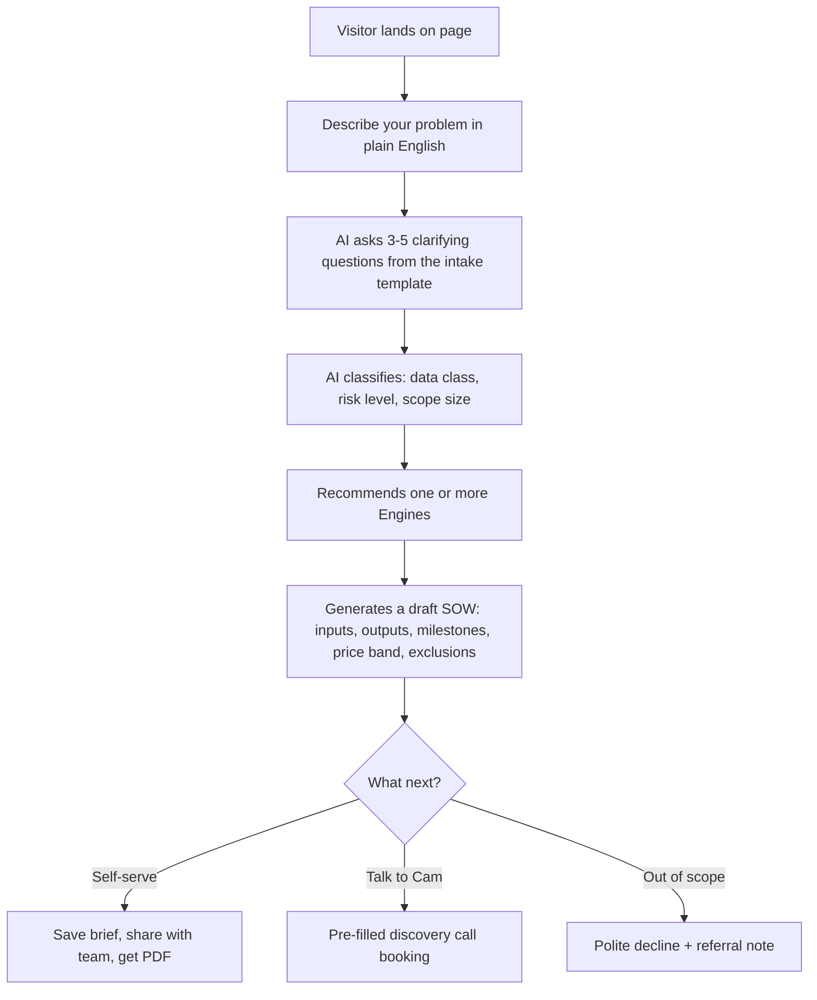

# Engine Labs — Landing Page & Service Ideation

## 1. Brand positioning (pick a lane)

The phrase "agentic company building agentic companies" is strong but abstract. Three sharper angles, each with different implications:

- **A. "The engine room for AI-powered businesses."** Heavy "operator" energy. Positions you as the workshop where founders build the internal machinery (workflows, agents, dashboards) that runs their business. Best fit for your current package set.
- **B. "Build the business. Then ship the AI workforce that runs it."** Founder/early-stage energy. Emphasises MVPs + agents as a combined offer. Best if you want to lean into the startup/MVP segment.
- **C. "Stop hiring for repeatable work. Engineer it instead."** SMB/agency energy. Frames AI as a labour-replacement decision, which is how most SMB owners already think about it. Most concrete for non-technical buyers. > Lets use this.

Recommendation: lead with **A** as the umbrella positioning and let the Control Centre conversation re-cast it as B or C based on what the visitor types in.

Naming the brand artefacts consistently:

- The company: **Engine Labs**
- The products: **Engines** (e.g. "Sales Engine", "Ops Engine")
- The methodology: **The Build → Run loop** (mirrors your intake → SOW → acceptance → handover → optional support flow)
- The interactive tool: **Control Centre**

## 2. Productized "Engines" (re-skinning your existing menu)

Your pricing schedule is a horizontal list of *capabilities* (automation, agent, dashboard, integration, etc.). Buyers shop by *outcome*. Re-skin the same scopes as outcome-named Engines so the landing page sells in their language while your SOW templates stay unchanged underneath.

- **Sales Engine** — lead intake → enrichment → qualification → CRM sync → first-touch draft (combines AI Agent + Workflow Automation + API Integration packages).
- **Ops Engine** — internal approvals, status reporting, recurring task automation, escalation routing.
- **Support Engine** — inbox triage, FAQ deflection, draft replies with human review (lean on your AI/Data/Security Addendum's human-review requirement as a feature, not a caveat).
- **Insight Engine** — dashboards + scheduled summaries from spreadsheets / CRMs / Stripe / GA (your Business Dashboard packages).
- **Founder Engine** — MVP build + clickable prototype + product roadmap (combines Startup MVP + Product Strategy packages). Strongest hook for pre-seed founders.
- **Knowledge Engine** — internal wiki + RAG agent that answers staff questions from SOPs/docs.
- **Back-office Engine** — invoice extraction, expense categorisation, document parsing (explicitly *not* advice — pure data prep).
- **Outreach Engine** — only for clients who can demonstrate consent/permission (gate this with the Addendum's anti-spam controls — turn the gate into a trust signal).

Each Engine page = one paragraph of outcome + 3 bullet inputs + 3 bullet outputs + a price band ("from A$450 → A$5,500 depending on scope") + a "Configure in the Control Centre" button. > this is great - include all of this.

## 3. Target verticals worth featuring

Pick 4–6 hero verticals where (a) your package set fits cleanly, (b) buyers self-identify with the pain, and (c) none of them trip your contract exclusions:

- Solo founders / pre-seed → **Founder Engine**
- Small marketing/creative agencies → **Ops + Insight + Content Engines**
- Trades & service businesses (plumbers, sparkies, landscapers) → **Sales + Support Engines** (huge AU SMB market, low AI literacy, high ROI)
- E-commerce / direct-to-consumer → **Support + Back-office + Insight Engines**
- Recruiters / staffing → **Sales + Ops Engines**
- Coaches, consultants, course creators → **Sales + Knowledge Engines**

Deliberately *exclude* from hero verticals: healthcare clinical, financial advice, legal advice, anything mission-critical. You can serve their *admin* layer, but don't lead with those logos. > this is good too.

## 4. The Client Control Centre (the hero experience)

This is the differentiator. The Centre is both the lead-capture tool and the proof of capability — it *is* an agentic product, built by an agentic company, helping someone build an agentic company. The medium is the message.

Core flow (mirrors your Intake Questionnaire, automated):

Things this does for you that a normal contact form can't:

- **Pre-qualifies leads** before they hit your inbox (saves your scoping hours).
- **Demonstrates the methodology** — the visitor *experiences* your intake → SOW workflow.
- **Surfaces exclusions gracefully** — when someone asks for "an AI that approves loans" or "scrape LinkedIn", the Centre can politely decline and explain why, using language straight from your Addendum. This turns your contract boundaries into trust signals.
- **Generates a shareable artefact** (draft SOW PDF) the visitor can take to their boss/co-founder. That's free distribution.
- **Eats its own dogfood** — the Centre is itself a Sales Engine + Founder Engine demo. The footer can say "This Control Centre was built with the Founder Engine in [X] days for A$[Y]." > love this last bit - definitely include it.

Optional Centre features for returning clients (the "control" part of "Control Centre"):

- Active project status board (milestone progress, payment state)
- Saved briefs / past SOWs
- Support tickets (ties into your SLA Addendum tiers)
- Handover docs / credentials checklist (mirrors your Handover Pack)
- "Ask the Engine" — RAG over their own handover docs so they can self-serve common questions > this is all great.

## 5. Landing page structure (top to bottom)

1. **Hero** — one-line positioning + Control Centre input field as the primary CTA (no "Book a call" button above the fold). "What's slowing your business down? We'll draft a solution for you."
2. **Control Centre demo** (or live) — visible immediately, not behind a click.
3. **The Engines** — 6-tile grid, each opens an Engine detail page.
4. **How we work** — the Build → Run loop, drawn as a diagram from your intake/acceptance/handover docs. This *is* your portfolio substitute.
5. **Pricing transparency** — show the package tiers from your Pricing Schedule. Most AI consultants hide pricing; you can use it as a wedge.
6. **What we don't do** — short, confident list pulled from your MSA/Addendum exclusions. Counter-intuitively a trust accelerator: shows you have professional boundaries.
7. **Governance & security** — short summary of the AI/Data/Security Addendum (data classes, human review, credential hygiene). Most competitors have nothing here.
8. **FAQ** — answer the questions your contracts already answer (IP ownership, what happens if a third-party API breaks, how revisions work, how support tiers work).
9. **Footer CTA** — back to the Control Centre.

Deliberately *omitted* until you have material: a logo wall, testimonials, "trusted by" line, fake stats. > all of this is great.

## 6. How to stand out without a portfolio

Five substitutes for case studies you can ship in week one:

- **The Control Centre itself** — using it is the proof.
- **Public methodology** — publish the intake questionnaire, the acceptance form, and a sample SOW as downloadable PDFs. Almost no freelancer does this, so it reads as senior.
- **Engine "spec sheets"** — for each Engine, publish the input list, output list, integrations, typical timeline, and a sample milestone breakdown. Reads as a product catalog, not a freelance gig.
- **"Build in public" log** — a `/lab` or `/builds` page where you ship one tiny demo Engine per week (e.g. "Inbox triage agent for a 1-person agency, built in 4 hours, full SOW + handover doc attached"). Each one becomes a synthetic case study you fully own.
- **Anti-claim posture** — explicitly say "we won't promise revenue lift, we won't take on regulated decisions, we won't quote without a paid scoping call for anything over A$5k". This language already exists in your MSA and Pricing Schedule — surface it on the page. > all of this is good.

## 7. Constraints to honour (from your contracts)

When writing landing page copy, the Control Centre prompts, and Engine descriptions, the following should be baked in so the page never writes cheques the contracts won't cash:

- No outcome guarantees (revenue, leads, uptime, accuracy) — see MSA §16.
- Every AI-output workflow shown must imply a human review step — see Addendum §4.
- Sensitive/regulated data use cases get a "talk to us first" gate, not a self-serve Engine — see Addendum §2 and §5.
- Pricing shown is *starting* pricing for controlled scopes, with a clear path to a paid scoping workshop for unclear/larger work — see Pricing Schedule §7.
- IP language anywhere on the page should match MSA §13: client owns bespoke deliverables on full payment; you keep templates, reusable patterns, prompts and Background IP.
- Support is *opt-in* and tiered, not implied — see SLA Addendum §1. > all of this is good.

## 8. Suggested next steps (for a follow-up plan)

Once you've picked a positioning lane and a shortlist of Engines, the next plan can cover: (a) wireframe of the Control Centre flow, (b) the system prompt + classification logic for the recommending agent, (c) the page IA + copy doc, (d) the minimum tech stack to ship it. None of those are in scope for this ideation pass. > lets start with all of these now using multiple agents to plan.